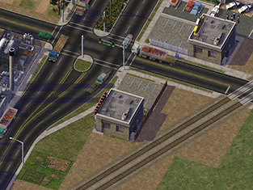
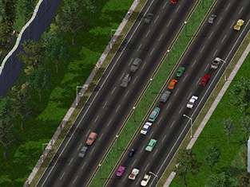

Grazie per aver scaricato il **Network Addon Mod (NAM)** per SimCity 4 Deluxe (o SimCity 4 con l'espansione Rush Hour). Il NAM è un mod completo per i trasporti, che aggiunge al gioco l'equivalente di più pacchetti di espansione di nuovi contenuti per i trasporti. Oltre a correggere la simulazione del traffico e le caratteristiche della rete di base del gioco, aggiunge innumerevoli nuove funzionalità agli strumenti di rete esistenti, come nuovi cavalcavia, rampe autostradali, intersezioni, carreggiate più larghe, centri pedonali, metropolitana leggera trascinabile, rotatorie e corsie di svolta, oltre a molte altre caratteristiche.

Si noti che questa documentazione è ancora in fase di transizione e che alcuni link possono fare riferimento a documenti più vecchi ma ancora ampiamente rilevanti.

La versione più recente di questa documentazione è sempre disponibile all'indirizzo [https://www.sc4nam.com](https://www.sc4nam.com).

**Questa release è dedicata a CorinaMarie, Admin di Simtropolis (e coautrice del nostro script batch): le auguriamo il meglio per la sua guarigione e speriamo di rivederla presto.**

&nbsp;

<!---->

## Disclaimer
Gli utenti scaricano, installano ed eseguono questa mod completamente ed esclusivamente a proprio rischio e pericolo. Electronic Arts (EA), i creatori e i singoli collaboratori non sono responsabili di eventuali errori, crash, problemi o qualsiasi altro problema che si possa verificare se si è scaricato e applicato questo file mod al gioco. I giocatori devono inoltre aspettarsi che eventuali patch e/o pacchetti di espansione futuri e SimCityscape possano non funzionare correttamente con il gioco se si è scaricata e applicata questa mod al gioco. L'uso di questo documento, delle informazioni in esso contenute e del Network Addon Mod è subordinato all'accettazione di questa clausola di esclusione della responsabilità e di tutto ciò che è contenuto in questo documento.

## Un grande grazie
I ringraziamenti vanno innanzitutto agli amministratori dei siti di SC4, per aver creato e lavorato sui loro siti al fine di renderli una comunità di SimCity 4 vivace. Senza di loro, nulla di tutto questo sarebbe possibile. Un ringraziamento molto speciale va all'intera comunità di SC4 e a tutti i membri che hanno contribuito a questo Network Addon Mod nella sua forma attuale.