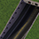



## New Method: Subway-based Draggable Override Network

The newest method for building Flexible Underpasses (FLUPs) involves the use of overrideable FLEX-based Portals, coupled with Subway-based draggable override networks, and overrideable FLEX-based overcrossing pieces.  The new method currently supports tunnel portals for four networks in the RealHighway (RHW) plugin: the RHW-2, RHW-3, RHW-4, and the MIS Ramp.

The menu button used to access the Subway-based FLUPs content is located under the Highways menu, and it contains the items listed below:

#### RHW Flex-FLUPs Button

1. FLEX FLUPs RHW Portal
2. FLEX FLUPs Road Portal
3. FLEX FLUPs One-Way Road Portal
4. Underground Road-2 (URoad-2) Starter Piece (for use with RHW-2 and Road portals)
5. Underground Road-3 (URoad-3) Starter Piece
6. Underground Ramp (URamp) Starter Piece
7. Underground Road-4 (URoad-4) Starter Piece (for use with RHW-4 and One-Way Road portals)
8. Underground Road-6S (URoad-6S) Starter Piece
9. Street FLEX Overcrossing
10. Road FLEX Overcrossing
11. One-Way Road FLEX Overcrossing
12. Avenue FLEX Overcrossing
13. Street FLEX Overcrossing
14. RHW FLEX Overcrossing
15. Rail FLEX Overcrossing
16. Light Rail FLEX Overcrossing
17. Monorail FLEX Overcrossing
18. Ground Highway FLEX Overcrossing
19. Elevated Highway FLEX Overcrossing

To begin constructing a Subway-based FLUPs system, first place the Tunnel Portals at the desired entrance and exit points for your underground route:





To start the underground portion itself (**new instructions as of NAM 41**), either place down one of the network starter pieces, and drag the Subway network through it (note: it may not be visible until dragging Subway through it), and between the portals, or build the Subway first, place the starter piece on top of it (using the Traffic Data View as a guide), then click in the vicinity with the Subway tool to convert it to the appropriate network.





As the Portal is FLEX-based, it can accept overrides, and be converted to other networks by simply connecting an override network into it. At present, the only accepted override networks, for the RHW portal, the RHW-3, RHW-4, RHW-6S, and MIS Ramp, while the Road and One-Way Road portals presently do not accept overides. To make this conversion, simply place the starter piece of the desired override network somewhere before the start of the Portal, and drag it into the ground end. (Note that this above ground action no longer affects the underground network directly--this change was made in NAM 41 to improve the stability and reliability of the Subway-based FLUPs system.)





As noted before, the Subway-based override networks can be used to create curving tunnels. The premise for constructing these is the same as with any other override network. Note that the "sharp" bends to diagonal may break the override. Ensure the bend is at the proper angle to prevent reversion to the base Subway network.



Some minor glitches may appear near the starter pieces of the underground network after doing so; these are unavoidable and do not affect the functionality of the network.



Being that the underground network is Subway-based, it can cross under blank terrain, Zones, Buildings (Zoned or Plopped), and Parks and remain functional, without any issue or additional work. Much like the base Subway network, commuters and freight can "shortcut" to and from Zones/Buildings to the underground network--this is an unavoidable part of game behavior. Being fully pathed as a standard Road or Highway-type network underground, all three Transit Types normally associated with those networks-- Cars, Buses, and Freight Trucks--can use the Subway-based FLUPs. Note, however, that the Subway-based FLUPs **cannot cross standard Subways**.



While it is physically possible to build other networks over top of the Subway-based FLUPs, doing so will normally block traffic and render the underground network non-functional. This can, however, be circumvented by using the FLEX Overcrossing Pieces (FLEX-OCPs). To build an overcrossing, simply find the FLEX piece for the appropriate network, place it down, and reconnect the network through the gap created by the Construction Tile. To ensure proper placement over top of the underground network, use one of the game's Traffic DataViews, like the Traffic Congestion DataView (pictured) or the Traffic Volume Data View, in order to locate it.







If built properly, a textured red ribbon should appear across the spot where the undercrossing exists when one hovers over it with one of the Query tools. If the underground network is carrying traffic, it should be visible here with the Traffic Query. (Note that the underground network itself will not register traffic on the Traffic Query, due to the game not being set up to report Car/Bus/Freight Truck traffic on the Subway network.)



Given that the overcrossing is FLEX-based, it can convert to match supported override networks for that base network. Below, the Road FLEX Overcrossing Piece was converted to L1 Road Viaduct, simply by hooking the L1 Road Viaduct Starter into it.



The following override networks are supported by each of the following Overcrossing Pieces:

* **Road**: L1 Road Viaduct, L2 Road Viaduct, TLA-3, AVE-2, ARD-3, NRD-4, TLA-5, RD-4, RD-6, TLA-7, AVE-6
* **One-Way Road (OWR)**: L1 OWR Viaduct, L2 OWR Viaduct, OWR-1, OWR-3, OWR-4, OWR-5
* **Avenue**: L1 Avenue Viaduct, L2 Avenue Viaduct
* **Rail (RRW)**: Single-Track Rail (STR)
* **Elevated (Light) Rail/Tram:**: Ground Light Rail (GLR--all styles)
* **RealHighway (RHW)**: All RHW override networks

The following override/FLEX/puzzle networks are **NOT** supported at present:

* Street Addon Mod (SAM) Override Networks
* High Speed Rail Project (HSRP) Override Networks
* L1 and L2 Rail (ERRW) Viaducts
* Hybrid Railway (HRW)
* Alternate Viaducts
* GLR/Tram-in-Avenue (TiA)
* GLR/Tram-in-Road (TiR)
* GLR/Tram-on-Road (ToR)
* GLR/Tram-on-Street (ToS)
* Elevated (Light) Rail (ELR)-over-Road (EoR)
* Elevated (Light) Rail (ELR)-over-Avenue (EoA)
* Elevated (Light) Rail (ELR)-over-RD-4 (EoRD-4)

### Additional Notes

* Crossings involving diagonals are also not supported at present.
* U-Drive-It (UDI) functionality is also unfortunately not possible with the Subway-based override network. The old puzzle pieces do still support UDI.
* The transit types supported by the FLEX FLUPs portals are Cars, Buses, and Freight Trucks. The portals and the URoad networks do not support Pedestrian/Sim paths, nor any other transit type.
* The Monorail and Elevated Highway FLEX Overcrossings may produce indestructible shadows. This has proven thus far to be unavoidable and uncorrectable.
* Much as with the previous puzzle-based FLUPs, which are Road-based, due to how the Traffic Simulator's hardcoded aspects inherit properties for networks using unexpected transit types, the capacity and speed for the Subway-based FLUPs are also identical to that of the Road network.
* The new FLEX-based FLUPs Portals do support nightlighting. To see the nightlighting on the Portals, ensure they are connected to Power. Both Maxis Nite and Dark Nite options are available. Maxis Nite is installed by default, but Dark Nite may be selected under the "7_Texture and Drive Side" section of the NAM installer, under each texture/drive-side combination.
* When bulldozing the new URoad starter pieces, the starter may appear in the above ground view after demolition while in Subway view. To fully remove it, demolish it in the above ground view as well.
* The Road and One-Way Road portals are designed to hook into the URoad-2 and URoad-4 networks, respectively. There are no separate underground networks for use with these portals, nor are there any plans to add them.



## Old Method: Puzzle Pieces

This documentation has not yet been written. However, an online tutorial by Chrisim can be found [here](https://sc4devotion.com/forums/index.php?topic=10876.0).