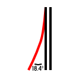
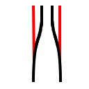



## Constructing RealExpressways

### Ramp Interface Basics

At the core of the RealExpressway are the **Ramp Interfaces**, which allow exit and entrance ramps to branch from or merge into the through lanes, or "mainline", of a stretch of highway.



Ramp Interfaces come in a wide variety of shapes and sizes, so to properly identify each ramp, there are two, sometimes three or even four parts to the name.
These indicate the mainline width, the branch angle and width, as well as whether any of the branch lanes were "exit only" or "acceleration" lanes - lanes added to or subtracted from the mainline.
Some more specialized ramp interfaces may append a fourth part, containing other information about the nature and location of the branch in relation to the mainline.

The mainline portion will always indicate the width of the "top" portion of the ramp interface, where the mainline is guaranteed to be at its widest.
In the case of FLEXRamps, since they are often shared by multiple networks which override a base version, the mainline network is usually excluded from the in-game description.

For the "type" designation, the number indicates the number of lanes included in the branch, while the letter indicates the branch angle and indicates whether the branch has any lanes that peel off (on exit) or join (on entrance) the mainline.
The letter/number types translate as follows:

<!-- Note, this is in HTML due to an issue with how specific tables are rendered -->

    <table class="w-auto table-bordered">
        <tr>
            <td></td>
            <td></td>
            <td></td>
            <td></td>
            <td></td>
            <td></td>
        </tr>
        <tr>
            <td>Type A1</td>
            <td>Type B1</td>
            <td>Type C1 <i>Not available</i></td>
            <td>Type D1</td>
            <td>Type E1</td>
            <td>Type F1 <i>Not available</i></td>
        </tr>
        <tr>
            <td class="fs-6">A single-lane (OWR-1) branch off the mainline, with an orthogonal branch. No lanes peel off the mainline.</td>
            <td class="fs-6">A single-lane (OWR-1) branch off the mainline, with a diagonal branch. No lanes peel off the mainline.</td>
            <td class="fs-6">A single-lane (OWR-1) branch off the mainline, with a fractional angle (18.4°) branch. No lanes peel off the mainline.</td>
            <td class="fs-6">A single-lane (OWR-1) branch off the mainline, with an orthogonal branch. The branch is formed from one lane of the mainline, and the mainline has one fewer lane at the bottom.</td>
            <td class="fs-6">A single-lane (OWR-1) branch off the mainline, with a diagonal branch. The branch is formed from one lane of the mainline, and the mainline has one fewer lane at the bottom.</td>
            <td class="fs-6">A single-lane (OWR-1) branch off the mainline, splitting at a fractional angle (18.4°) from the mainline. The branch is formed from one lane of the mainline, and the mainline has one fewer lane at the bottom.</td>
        </tr>
        <tr>
            <td></td>
            <td></td>
            <td></td>
            <td></td>
            <td></td>
            <td></td>
        </tr>
        <tr>
            <td>Type A2</td>
            <td>Type B2</td>
            <td>Type C2 <i>Not available</i></td>
            <td>Type D2</td>
            <td>Type E2</td>
            <td>Type F2 <i>Not available</i></td>
        </tr>
        <tr>
            <td class="fs-6">A dual-lane (OWR-2) branch off the mainline, with an orthogonal branch. One of the two lanes on the branch is from the mainline, and the mainline has one fewer lane at the bottom.</td>
            <td class="fs-6">A dual-lane (OWR-2) branch off the mainline, with a diagonal branch. One of the two lanes on the branch is from the mainline, and the mainline has one fewer lane at the bottom.</td>
            <td class="fs-6">A dual-lane (OWR-2) branch off the mainline, with a fractional angle (18.4°) branch. One of the two lanes on the branch is from the mainline, and the mainline has one fewer lane at the bottom.</td>
            <td class="fs-6">A dual-lane (OWR-2) branch off the mainline, with an orthogonal branch. Both lanes on the branch are from the mainline, and the mainline has two fewer lanes at the bottom.</td>
            <td class="fs-6">A dual-lane (OWR-2) branch off the mainline, with a diagonal branch. Both lanes on the branch are from the mainline, and the mainline has two fewer lanes at the bottom.</td>
            <td class="fs-6">A dual-lane (OWR-2) branch off the mainline, with a fractional angle (18.4°) branch. Both lanes on the branch are from the mainline, and the mainline has two fewer lanes at the bottom.</td>
        </tr>
        <tr>
            <td></td>
            <td></td>
            <td></td>
            <td></td>
            <td></td>
            <td></td>
        </tr>
        <tr>
            <td>Type A3 <i>Not available</i></td>
            <td>Type B3 <i>Not available</i></td>
            <td>Type C3 <i>Not available</i></td>
            <td>Type D3 <i>Not available</i></td>
            <td>Type E3 <i>Not available</i></td>
            <td>Type F3 <i>Not available</i></td>
        </tr>
        <tr>
            <td class="fs-6">A triple-lane (OWR-3) branch off the mainline, with an orthogonal branch. Two of the three lanes on the branch is from the mainline, and the mainline has two fewer lanes at the bottom.</td>
            <td class="fs-6">A a triple-lane (OWR-3) branch off the mainline, with a diagonal branch. Two of the three lanes on the branch is from the mainline, and the mainline has two fewer lanes at the bottom.</td>
            <td class="fs-6">A triple-lane (OWR-3) branch off the mainline, with a fractional angle (18.4°) branch. Two of the three lanes on the branch is from the mainline, and the mainline has two fewer lanes at the bottom.</td>
            <td class="fs-6">A triple-lane (OWR-3) branch off the mainline, with an orthogonal branch. All three lanes on the branch are from the mainline, and the mainline has three fewer lanes at the bottom.</td>
            <td class="fs-6">A triple-lane (OWR-3) branch off the mainline, with a diagonal branch. All three lanes on the branch are from the mainline, and the mainline has three fewer lanes at the bottom.</td>
            <td class="fs-6">A triple-lane (OWR-3) branch off the mainline, with a fractional angle (18.4°) branch. All three lanes on the branch are from the mainline, and the mainline has three fewer lanes at the bottom.</td>
        </tr>
    </table>

Ramps may have an additional modifier on their name to further describe unique characteristics about the ramp:

    <table class="w-auto table-bordered">
        <tr>
            <td></td>
            <td></td>
            <td></td>
            <td></td>
            <td></td>
        </tr>
        <tr>
            <td>Outside</td>
            <td>Inside</td>
            <td>Wide</td>
            <td>Wye</td>
            <td>Shift</td>
        </tr>
        <tr>
            <td class="fs-6">The standard ramp where the branch is on the outside (right side in countries with right-hand traffic, left side in those with left-hand traffic).</td>
            <td class="fs-6">The ramp branch is on the inside (left exit/entrance in countries with right-hand traffic, right exit/entrance for those with left-hand traffic), rather than the expected outside.</td>
            <td class="fs-6">The ramp branch has a larger separation than the standard version of that type. Most commonly applied to A1 and A2 ramps.</td>
            <td class="fs-6">Both the branch and the mainline diverge from the path of the mainline at the top in a symmetrical fashion, forming a wishbone or Y-shape. Typically the mainline is the same width as the branch.</td>
            <td class="fs-6">The mainline undergoes curvature in the midst of the ramp. This occurs when the mainline shifts from an S-type network to a C-type network.</td>
        </tr>
        <tr>
            <td></td>
            <td></td>
            <td></td>
            <td></td>
        </tr>
        <tr>
            <td>Dual</td>
            <td>Folded</td>
            <td>Diagonal</td>
            <td>FA</td>
        </tr>
        <tr>
            <td class="fs-6">There are two ramp branches on the ramp interface. This is most commonly seen with the bidirectional networks (RHW-2, RHW-3, and Double-Decker RHWs), or in conjunction with Shift.</td>
            <td class="fs-6">There are two ramp branches that curve off at 90-degree angles, in opposite directions. There is only one Folded ramp interface, the RHW-2 D1 Folded.</td>
            <td class="fs-6">The mainline is diagonal rather than orthogonal. The branch angles are handled the same as if the ramp were orthogonal (i.e. an orthogonal ramp branch off a diagonal ramp interface would still be an A or D-type ramp of some sort).</td>
            <td class="fs-6">The mainline is at a fractional angle rather than orthogonal. The branch angles are handled the same as if the ramp were orthogonal (i.e. an orthogonal ramp branch off an FA ramp interface would still be an A or D-type ramp of some sort).</td>
        </tr>
    </table>

Note that the case of REW, separate Outside and Inside ramps are not needed (unlike the RHW's ramp system) because OWR can be drawn and overridden in either direction.

### Building Ramp Interfaces

There are two methods of building REW Ramp Interfaces: using the FLEX Pieces (), or through draggable means (only available for certain ramps).
1. **FLEXRamps** - These are ploppable, generally slope-tolerant, and conform to match the surrounding network via overrides. These can be found under the found under the RealExpressway One-Way Road FLEXRamps button on the Roads Menu.

2. **Draggable Ramp Interfaces (DRIs)** - These are pattern-based draggable items, built by dragging the OWR network tool according to a specific pattern. Like the FLEXRamps, these will conform to match the surrounding network via overrides. These are only available in limited circumstances.


All types of ramps are not able to be constructed through all methods. Some may be possible to construct through both three methods, while some are only possible with one of the methods.
When available, DRIs are the preferred method for most ramp interfaces.
However, the majority of ramps are currently only available as FLEXRamps and are not possible with DRI setups.
A full listing of capabilities can be found in the [REW Compatibility Guide](/docs/tech-specs/realexpressway)


#### Using FLEXRamps

In order to use a ramp interface to connect a branch to an One Way Road, first place the desired ramp interface.
Then drag OWR through the mainline and the branch to extend the ramp, just like using a starter piece.
The network will convert to match the ramp.


    images/rew-flex-1.jpg
    images/rew-flex-2.jpg | Place starter piece
    images/rew-flex-3.jpg | Drag OWR through the mainline
    images/rew-flex-4.jpg | Drag OWR through the branch
    images/rew-flex-5.jpg | 🎉



In the case of the Road splitter ramps, use the Road network out the top of the ramp instead.



Unlike FLEXRamps of other network types, REW FLEXRamps *cannot* be placed directly over an existing stretch of OWR. You must use the Bulldozer or the NAM's [Network Eraser](/docs/feature-guides/network-eraser) to make a place for the FLEXRamp to be plopped.

The REW FLEXRamps use special network flags to counteract the game's hardcoded "Tidal Flow" system of determining the direction of a One-Way Road, meaning they are effectively bidirectionally-pathed at all times.
This can be seen with the `DrawPaths` cheat enabled - note the green "X's" over the ramp portion of the piece - and allows the ramp to be functional regardless of the direction OWR is dragged through it.



The Draggable Ramp Interfaces (DRIs) behave differently, and are not bidirectionally-pathed.
These instead fully align with the Tidal Flow system.




#### Building Draggable Ramp Interfaces (DRIs)

Draggable Ramp Interfaces, or DRIs, are ramp interfaces that are constructed as draggable patterns using the One-Way Road network.
With the exception of a very few specialized setups, currently only a few REW ramp interface setup can be built through draggable means.
Each ramp interface type supported by the system has a special drag pattern, which when constructed, will automatically convert into the appropriate on/offramp.

The build methods are shown below:

A1 Orthogonal Ramp

    images/rew-draggable-a1-orth-1.jpg
    images/rew-draggable-a1-orth-2.jpg
    images/rew-draggable-a1-orth-3.jpg



    images/rew-draggable-b1-orth-1.jpg
    images/rew-draggable-b1-orth-2.jpg



    images/rew-draggable-a1-diag-1.jpg
    images/rew-draggable-a1-diag-2.jpg
    images/rew-draggable-a1-diag-3.jpg



    images/rew-draggable-b1-diag-1.jpg
    images/rew-draggable-b1-diag-2.jpg

