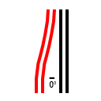



The RealExpressway (REW) system adds a series of Ramp Interfaces (both FLEX Piece-based and draggable) to the base One-Way Road (OWR) network and the additional OWR widths of Network Widening Mod (NWM). As such, it requires that the Network Widening Mod be installed as part of one's NAM installation. The REW's ramps can be used to recreate urban and suburban surface arterials that have expressway/freeway-like features, Texas-style frontage roads supporting RCI development/access (especially in combination with RealHighways), or various novel intersection configurations.

## Building REW Ramp Interfaces

There are two methods of building REW Ramp Interfaces: using the FLEX Pieces (found under the RealExpressway One-Way Road FLEXRamps button on the Roads Menu), or through draggable means (only available for certain ramps).

The FLEX Pieces are the simpler way to build REW ramps. First, under the REW Ramp Interfaces button, cycle through TAB or Shift-TAB (Ctrl-TAB or Ctrl-Shift-TAB on Mac) to the desired ramp interface, and place it. Then, drag the One-Way Road tool through the mainline, and finally, through the ramp--which, in this case, will convert to the 1-Lane One-Way Road network (OWR-1) from the Network Widening Mod (NWM). In the case of the Road splitter ramps (new to NAM 45), use the Road network out the top of the ramp instead.


    images/rew-flex-1.jpg
    images/rew-flex-2.jpg
    images/rew-flex-3.jpg
    images/rew-flex-4.jpg
    images/rew-flex-5.jpg


As the REW FLEXRamps use special network flags to counteract the game's hardcoded "Tidal Flow" system of determining the direction of a One-Way Road, they are effectively bidirectionally-pathed at all times (as shown in the image below, in which the DrawPaths cheat from SimCity 4 Extra Cheats.dll has been turned on). The directionality is irrelevant. Note, however, that this means that REW FLEXRamps CANNOT be placed directly over an existing stretch of One-Way Road (or an NWM OWR). One must use the Bulldozer or the NAM's Network Eraser to make a place for the FLEXRamp to be plopped.



The Draggable Ramp Interfaces (DRIs) behave differently, and are not bidirectionally-pathed, instead aligning with the Tidal Flow system. Note that in both cases, separate Outside and Inside ramps are not needed, unlike the RHW's ramp system.



The build methods are shown below:


    images/rew-draggable-a1-orth-1.jpg
    images/rew-draggable-a1-orth-2.jpg
    images/rew-draggable-a1-orth-3.jpg



    images/rew-draggable-b1-orth-1.jpg
    images/rew-draggable-b1-orth-2.jpg



    images/rew-draggable-a1-diag-1.jpg
    images/rew-draggable-a1-diag-2.jpg
    images/rew-draggable-a1-diag-3.jpg



    images/rew-draggable-b1-diag-1.jpg
    images/rew-draggable-b1-diag-2.jpg


The nomenclature for REW ramps is essentially the same as for the RHW.

<!-- Note, this is in HTML due to an issue with how specific tables are rendered -->

    <table class="bg-white w-auto table-bordered">
        <tr>
            <td class="bg-white"></td>
            <td class="bg-white"></td>
            <td class="bg-white"></td>
            <td class="bg-white"></td>
        </tr>
        <tr>
            <td>Type A1</td>
            <td>Type B1</td>
            <td>Type D1</td>
            <td>Type E1</td>
        </tr>
        <tr>
            <td class="bg-white"></td>
            <td class="bg-white"></td>
            <td class="bg-white"></td>
            <td class="bg-white"></td>
        </tr>
        <tr>
            <td>Type A2</td>
            <td>Type B2</td>
            <td>Type D2</td>
            <td>Type E2</td>
        </tr>
    </table>

* A1: Indicates a single-lane (OWR-1) branch off the mainline, with an orthogonal branch. No lanes peel off the mainline.
* B1: Indicates a single-lane (OWR-1) branch off the mainline, with a diagonal branch. No lanes peel off the mainline.
* D1: Indicates a single-lane (OWR-1) branch off the mainline, with an orthogonal branch. The branch is formed from one lane of the mainline, and the mainline has one fewer lane at the bottom.
* E1: Indicates a single-lane (OWR-1) branch off the mainline, with a diagonal branch. The branch is formed from one lane of the mainline, and the mainline has one fewer lane at the bottom.
* A2: Indicates a dual-lane (OWR-2) branch off the mainline, with an orthogonal branch. One of the two lanes on the branch is from the mainline, and the mainline has one fewer lane at the bottom.
* B2: Indicates a dual-lane (OWR-2) branch off the mainline, with a diagonal branch. One of the two lanes on the branch is from the mainline, and the mainline has one fewer lane at the bottom.
* D2: Indicates a dual-lane (OWR-2) branch off the mainline, with an orthogonal branch. Both lanes on the branch are from the mainline, and the mainline has two fewer lanes at the bottom.
* E2: Indicates a dual-lane (OWR-2) branch off the mainline, with a diagonal branch. Both lanes on the branch are from the mainline, and the mainline has two fewer lanes at the bottom.

Below is a list of the modifiers:

* **Inside:** This designation is seen on ramps from one-way RHW networks, and indicates that the ramp branch is on the inside (left exit/entrance in countries with right-hand traffic, right exit/entrance for those with left-hand traffic), rather than the expected outside.
* **Wide:** This designation indicates that the ramp branch has a larger separation than the standard version of that type, and is most commonly applied to A1 and A2 ramps.
* **Wye:** This designation indicates that both the branch and the mainline (often when the mainline is of the same width as the branch) both diverge from the path of the mainline at the top in a symmetrical fashion, forming a wishbone or Y-shape.
* **Shift:** This is an indication that the mainline undergoes curvature in the midst of the ramp. This occurs when the mainline shifts tile widths.
* **Dual:** This is an indication that there are two ramp branches on the ramp interface. This is most commonly seen with the bidirectional networks, or in conjunction with Shift.
* **Folded:** This is an indication that there are two ramp branches that curve off at 90-degree angles, in opposite directions. There is only one Folded ramp interface in the REW, the Road D1 Folded Wye.
* **Diagonal:** This designation indicates that the mainline is diagonal rather than orthogonal. The branch angles are handled the same as if the ramp were orthogonal (i.e. an orthogonal ramp branch off a diagonal ramp interface would still be an A or D-type ramp of some sort).
* **FA:** This designation indicates that the mainline is at a fractional angle rather than orthogonal. The branch angles are handled the same as if the ramp were orthogonal (i.e. an orthogonal ramp branch off an FA ramp interface would still be an A or D-type ramp of some sort).

The current set of FLEXRamps available for the REW (22 in total) is shown below:

