<!-- markdownlint-disable MD051 -->



    images/rhwteaser1.jpg
    images/rhwteaser2.jpg
    images/rhwteaser3.jpg
    images/rhwteaser4.jpg


## Installing the RealHighway Mod

A  complete install of the RealHighway plugin is one of the features included by default in the NAM Installer. There is a whole section dedicated to the RealHighways and related optional features.

Under the "_2 Additional Network Features_" section, selecting the "_RealHighway_" box will install the mod in its entirety. Deselecting any of the other boxes under this section should only be done by advanced users who are manually compiling a NAM Controller to exclude certain RHW networks.

Note that the RHW **requires a 4GB_Full NAM Controller, and as such, also requires the 4GB Patch**. It is the largest component in the NAM package by a wide margin, and requires a 64-bit operating system and at least 4GB RAM to utilize.

Euro textures for the RealHighways will be automatically installed if one selects one of the Euro road texture options.

## RealHighway vs Maxis Highway

There are some key differences in terms of how the RHW system operates compared with the default Maxis highways:

* Rather than one width and two height levels, RHW networks come in a variety of shapes and sizes, ranging from 2-lane rural highways to 10-lane freeways. All networks in the system can be built at either three or five different height levels. There is also some support for Double-Decker Highways.

* The RHW allows for an extremely high level of user customization and creativity for those who want precise control over constructing interchanges. While the Maxis Highway system includes all-in-one, prefabricated interchanges and overpasses that can be plopped or automatically constructed, most RHW interchanges must be built manually using a series of interchangeable, modular pieces. As such, the RHW is more complicated to use with a higher learning curve, but offers a much greater degree of control. However, recent NAM releases have included features making the RHW system more accessible by migrating toward "FLEX" pieces that can be used by multiple networks, and the introduction of the [QuickChange](/docs/feature-guides/realhighway-mod/#QCX) system which contains some basic pre-built interchanges.

* As evidenced by the "real" part of the name, the RHW also brings some semblance of real-world scaling to SC4 highways, based on current transportation design standards. As such, transitions and interchanges are larger, sometimes considerably, when compared to the compressed scale of the Maxis Highways.

## RealHighway Base and Override Networks

The RealHighway system avails itself of the only unfinished network stub left in the game (formerly known as the Additional Network Tool "ANT", or the "DirtRoad" network), and turns it into the RHW's true base network, the 2-lane RealHighway (RHW-2), along with 36 override networks.
With the exception of the Modular Interchange System (MIS) Ramp override network, the nomenclature used for RealHighway networks distinguishes each networks by the total number of lanes to facilitate two-way traffic with the network. For instance:
* RHW-2 contains two lanes, one in each direction.
* RHW-4 has four lanes, two in each direction. While each individual tile of RHW-4 may only carry two lanes going in one direction, full bidirectional traffic with RHW-4 requires two stretches of the network traveling in opposite directions, resulting in a total of four lanes.

With some of the wider networks, the letters "S" or "C" may be added after the lane count designation (i.e. RHW-8S or RHW-6C).
* "S" is an indication for "separable", meaning that the lanes carrying travel in the opposite direction may be separated by any distance.
* "C" stands for "combined", meaning the center tile of the "C" networks carries the median separating the two directions of traffic, thereby making it inseparable. 

It is also possible to make _ad hoc_ asymmetrical networks as well. For instance, one could create a 5-lane highway by using the RHW-4 on one side, and an RHW-6S on the other. The C-type networks, while not separable, also support this sort of functionality, and a dedicated starter exists for an "RHW-7C", which uses parts of the RHW-8C and RHW-6C for construction.

### RealHighway Network Widths

The following networks are included as part of the RealHighway mod.


| Network | Full Name | Tile Width |
| --- | --- | --- |
| MIS Ramp | Modular Interchange System Ramp | 1 (One-Way) 2 (Two-Way) |
| RHW-2 | 2-lane RealHighway | 1 (Two-Way) |
| RHW-3 | 3-lane RealHighway | 1 (Two-Way) |
| RHW-4 | 4-lane RealHighway | 1 (One-Way) 2 (Two-Way) |
| RHW-6S | 6-lane Separable RealHighway | 1*(One-Way) 2* (Two-Way) |
| RHW-8S | 8-lane Separable RealHighway | 2 (One-Way) 4 (Two-Way) |
| RHW-10S | 10-lane Separable RealHighway | 2 (One-Way) 4 (Two-Way) |
| RHW-12S | 12-lane Separable RealHighway | 2*(One-Way) 4* (Two-Way) |
| RHW-6C | 6-lane Combined RealHighway | 3 (Two-Way) |
| RHW-8C | 8-lane Combined RealHighway | 3 (Two-Way) |


\* The **RHW-6S** and **RHW-12S** networks have partial tile overhang. The network itself only occupies one tile, but the shoulder will visually overlap part of the adjacent tile.


    images/base-and-override-networks/misramp.jpg
    images/base-and-override-networks/rhw2.jpg
    images/base-and-override-networks/rhw3.jpg
    images/base-and-override-networks/rhw4.jpg
    images/base-and-override-networks/rhw6s.jpg
    images/base-and-override-networks/rhw6c.jpg
    images/base-and-override-networks/rhw8s.jpg
    images/base-and-override-networks/rhw8c.jpg
    images/base-and-override-networks/rhw10s.jpg


    images/base-and-override-networks/rhw12s.jpg


### RealHighway Network Heights
There are multiple elevation levels for the RealHighway override networks as well. These heights are in increments of 7.5 meters and have a simple shorthand system of denoting each level:
* Level 0 (**L0**) networks are ground-level networks and have no elevation above the terrain
* Level 1 (**L1**) networks are at 7.5 meters
* Level 2 (**L2**) networks are at 15 meters
* Level 3 (**L3**) networks are at 22.5 meters
* Level 4 (**L4**) networks are at 30 meters

All RealHighway widths have **L0**, **L1**, and **L2** elevations at their disposal, each produced with a separate starter.
**MIS**, **RHW-4**, and **RHW-6S** also have the ability to reach **L3** and **L4** elevations.
Double-decker (DD) setups also exist (presently, only in a configuration with 4 total lanes, the DDRHW-4). The upper deck of the DDRHW is at **L2**, while the lower deck is at **L1**.



### Starter Pieces

The base draggable network can be found under the RHW-2 button.



The Starter Pieces can be found under the RHW Starters button.



All of the RHW networks can be constructed by first placing a Starter Piece, then dragging the RHW-2 network through the starter, causing the dragged RHW-2 to convert to match the starter. This process is shown below.



Multi-tile override networks work similarly. Place a Starter Piece, and drag RHW-2 through each tile of the starter piece.



Additionally, RHW Starter Pieces can be crossed by other RHW networks, allowing for maximally-stable highway-over-highway crossings.



### Zone Access Restrictions

The RealHighway family of networks is considered to be Highway-type by the game which limits its ability to provide direct access to zones and buildings, as one would expect from a highway.
This limitation is especially true of Residential zones, which cannot be built at all along RHW networks, and attempting to have any zone type use RealHighway network frontage for access is not recommended.
Instead, it's recommended to downgrade to a non-highway network, such as the Road, One-Way Road, or one of the [Network Widening Mod](/docs/feature-guides/network-widening-mod/) override networks if zone access is required.

## Capacities and Speeds

The capacity of each network depends on the [Traffic Plugin](/docs/feature-guides/the-nam-traffic-simulator) one has installed.
Capacity is generally calculated on a per tile basis by the game, as the game cannot read the number of lanes.
The capacities for the five standard capacity levels of the NAM Traffic Plugin are listed below. 


| RHW Network Type1,3                | Classic | Low | Medium | High | Ultra |
| ---                                           | :---: | :---: | :---: | :---: | :---: |
| MIS Ramps (single-tile capacity)              | 3000 | 6000 | 10000 | 15000 | 30000 |
| RHW-2 (single-tile capacity)                  | 3000 | 6000 | 10000 | 15000 | 30000 |
| RHW-3 (single-tile capacity)2      | 3750 | 7500 | 12500 | 18750 | 37500 |
| RHW-4 (dual-tile capacity)                    | 6000 | 12000 | 20000 | 30000 | 60000 |
| DDRHW-4 (single-tile capacity)2    | 3750 | 7500 | 12500 | 18750 | 37500 |
| RHW-6S (dual-tile capacity)2       | 7500 | 15000 | 25000 | 37500 | 75000 |
| RHW-6C (triple-tile capacity)2     | 11250 | 22500 | 37500 | 56250 | 112500 |
| RHW-8S (quadruple-tile capacity)2  | 15000 | 30000 | 50000 | 75000 | 150000 |
| RHW-8C (triple-tile capacity)2     | 11250 | 22500 | 37500 | 56250 | 112500 |
| RHW-10S (quadruple-tile capacity)2 | 15000 | 30000 | 50000 | 75000 | 150000 |
| RHW-12S (quadruple-tile capacity)2 | 15000 | 30000 | 50000 | 75000 | 150000 |


**1** The capacities listed are for the _full width_ of the network, rather than the per-tile capacity. 
**2** Networks with crossover paths (**RHW-6C**, **RHW-8S**, **RHW-8C**, **RHW-10S**, and **RHW-12S**) and networks which use a special workaround (**RHW-3**, **DDRHW-4**, and **RHW-6S**) have a 25% boost on capacity over the normal per-tile figure for the base RHW network. This boost can only be applied once, which is why the **DDRHW-4**, despite having one more lane than the **RHW-3**, has the same capacity. A similar situation exists with the **RHW-6C** and **RHW-8C**, and the **RHW-8S** and **RHW-10S**. This is a game limitation that currently cannot be overcome. 
**3** These figures also apply to all elevated versions of each network width - this means that the **L0** **RHW-4** will have the same capacity as its **L1**, **L2**, **L3**, and **L4** counterparts. 

The catalog speeds for the base RealHighway network are listed below. Note, however, that these catalog speeds are for 100% of catalog capacity, and that speeds on empty networks will exceed these figures by 30%, declining as the networks increase in volume per the Congestion vs. Speed Curve.


| Vehicle Type | Speed |
| --- | :---: |
| Car | 150 |
| Bus | 150 |
| Freight Truck | 130 |
| Pedestrian1 | 10 |


**1** Pedestrians are only permitted on the L0 RHW-2 network. 

## Constructing The RealHighway

### The Network Eraser: A RealHighway-Safe Bulldozer

The base RealHighway network has auto-connect functionality, similar to the way the Street network operates. This can make the network behave erratically when using the Bulldozer tool, and may result in more destruction than one intended, particularly when dealing with complicated interchanges constructed entirely from RealHighway components.



To combat this issue, the NAM includes an alternative demolition tool, the Network Eraser (previously known as the _RHW Disconnector_).  The Network Eraser can be found near the top of the Highways menu, as well as the the Roads, Rails, and Miscellaneous Transportation menus.



Plopping the Network Eraser over a single tile of RealHighway, including starter pieces, FLEX pieces, and intersections (but not puzzle pieces) will demolish only the tile directly under the cursor.



The Network Eraser is also used as part of some Pattern-Based Draggable setups used by the RealHighway plugin, particularly the [Draggable Ramp Interfaces (DRIs)](#draggable-ramp-interfaces). Additionally, it can be used in many situations with non-RHW networks as well.

### Constructing Diagonals and Base Curves

With the networks that are single-tile (RHW-2, RHW-3), or have self-contained single-tile halves (MIS, RHW-4, RHW-6S), one can simply drag the network out as would be normally expected in order to produce the curves to go diagonal with the network. Aside from the **L0** RHW-2, however, the shared-tile "double diagonal" setup cannot be built, and pairs of MIS, RHW-4, and/or RHW-6S carriageways must be separated, out into a split-tile setup.

For the wider RHW networks (the RHW-8S, RHW-10S, RHW-12S, RHW-6C, and RHW-8C), the split-tile diagonal setup must be used.



The default sharp 90-degree bends are only available with the RHW-2 and MIS Ramp networks (at all height levels), for the sake of realism. The MIS Ramp's version also overrides one "buffer tile" on either side of the bend itself, to produce a smoother result (one should take care not to impose upon these buffer tiles when building, as attempting to cram an intersection where they should go will simply destabilize the MIS Ramp override).

If one desires a smoother transition between orthogonal and diagonal, [Wide-Radius Curves and Multi-Radius Curves](/docs/feature-guides/realhighway-mod/#wide-radius-curves-wrcs-and-multi-radius-curves-mrcs) provide a solution. [Fractional Angle RealHighways (FARHW)](/docs/feature-guides/realhighway-mod/#fractional-angle-realhighways-farhw) are also available.

### Connecting RealHighways via Intersections, Crossings and Interchanges

The RealHighway system has two ways of connecting and crossing other networks: **At-Grade** and **Grade-Separated**. The smaller RealHighway networks, including the RHW-2 (L0-L2), RHW-3 (L0 only), MIS (L0-L2), and RHW-4 (L0-L2), have the ability to intersect and cross other networks at the same height level. To build these crossings, simply drag the desired RealHighway network through or up to the crossing network to build the type of crossing you want, just as one would with any other draggable network in the game.



For grade-separated crossings, where networks at different height levels--for instance, an L1 RHW-4 and the game's default Elevated Rail network (which is at L2)--follow the same exact process. All RealHighway networks at all height levels support grade-separated crossings.



For additional information about what network crossings are supported with the other components of the Network Addon Mod, refer to the [Compatibility With Other Networks](/docs/feature-guides/realhighway-mod/#network-and-flex-piece-capabilities) section of this document.

#### QuickChange Xpress: Full Interchanges in a Click {#QCX}

With the release of NAM 45 in mid-2022, the RealHighway has support for full ploppable interchanges, known as QuickChange Xpress (QCX). At present, only Diamond Interchanges involving the Road, Avenue, and 6-lane Avenue (AVE-6, from the Network Widening Mod) networks (with appropriate turn lanes applied on the surface networks and the on/offramps) exist. Four different RHW width configurations are supported (RHW-6S/RHW-4 Adjacent, RHW-6S/RHW-4 With Median, RHW-8C/6C, and RHW-10S/8S), and the option to have the RHW go over or under the surface street (in an L0/L1 configuration).

The QCX setups are located near the end of the TAB Loop under the RHW QuickChange button on the Highways Menu. TABing through will change the surface network width (Road or Avenue) and whether it or the RHW is elevated or the surface network is. Home/End rotation on each TAB entry will allow one to cycle through the different RHW widths/configurations supported.

To use a QCX, simply plop the interchange in its desired location/rotation, and connect it up with the surrounding networks. It's really that easy!


    images/quickchange/rhw-qcx-1.jpg
    images/quickchange/rhw-qcx-2.jpg
    images/quickchange/rhw-qcx-3.jpg
    images/quickchange/rhw-qcx-4.jpg
    images/quickchange/rhw-qcx-5.jpg


It is also possible to plop a QCX directly over an existing crossing.


    images/quickchange/rhw-qcx-6.jpg
    images/quickchange/rhw-qcx-7.jpg


#### On/Offramp (Ramp Interface) Basics

At the core of the RealHighway's Modular Interchange System are the **Ramp Interfaces**, which allow exit and entrance ramps to branch off from or merge into the through lanes, or "mainline", of a stretch of highway.



There are three possible ways to construct Ramp Interfaces:

* 
* 
* {{< menu-icon icon="images/icons/rhw-old-ramps-button" caption="Puzzle Piece Ramp Interfaces, which are conventional static puzzle pieces, many of which have starters attached to their ends. As these are static ploppables, they will not conform to the surrounding network, and one must select the specific puzzle piece for the desired network. This option is largely considered to be deprecated/outdated, with the exception of the few more specialized setups that have yet to receive FLEXRamp or DRI treatments. These can be found under the \"Ramps\" button." >}}

Note that there are some types of ramps that may only be possible through a certain construction method. FLEXRamps and DRIs are the preferred method for most ramp interfaces, and are the only option for most ramps involving elevated RealHighway networks. The puzzle piece method does presently contain a few specialized types that have not been made into FLEXRamp or DRI setups, however. A full listing of capabilities can be found [here](/docs/feature-guides/realhighway-mod/#network-and-flex-piece-capabilities), and there is also a listing of all [ploppable items (including FLEX and Puzzle Pieces)](/docs/feature-guides/realhighway-mod/#list-of-menu-items). More details on constructing each type can be found below.

In order to use a ramp interface to connect a RealHighway to one's surface network, first, build the desired ramp interface. Then, from the end of the branch, simply drag the RealHighway network tool out from it, just like using a starter piece. The network will convert to match the ramp. From there, simply continue dragging in the desired pattern, adding curves and transitions as necessary, and intersect the surface street with an At-Grade Crossing. (Note that the Fractional Angle ramps, Types C and F, do not support dragging, and the appropriate Fractional Angle RealHighway (FARHW) puzzle pieces must be used instead.)



In order to connect to another RealHighway, follow the same process, but instead of forming an At-Grade Crossing, simply connect the ramp into another Ramp Interface on the other RealHighway.



There are a number of different types of Ramp Interfaces included in the plugin, but at their core, they serve one purpose--to connect RealHighway-based freeways/motorways to the surface streets, or other RealHighway-based freeways/motorways. There are two, sometimes three or even four parts to the name of each ramp interface type. These indicate the mainline width, the branch angle and width, as well as whether any of the branch lanes were "exit only" or "acceleration" lanes, added or subtracted from the mainline. Some more specialized ramp interfaces may append that fourth part, containing other information about the nature and location of the branch in relation to the mainline. The mainline portion will always indicate the width of the "top" portion of the ramp interface, where the mainline is guaranteed to be at its widest. In the case of FLEXRamps, since they are often shared by multiple networks, which override a base version, the mainline network is usually excluded from the in-game description. For the "type" designation, the number indicates the number of lanes included in the branch, while the letter indicates the branch angle and indicates whether the branch has any lanes that peel off (on exit) or join (on entrance) the mainline. The letter/number types translate as follows:

<!-- Note, this is in HTML due to an issue with how specific tables are rendered -->

    <table class="bg-white w-auto table-bordered">
        <tr>
            <td class="bg-white"></td>
            <td class="bg-white">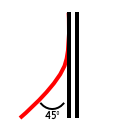</td>
            <td class="bg-white">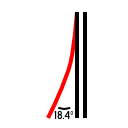</td>
            <td class="bg-white">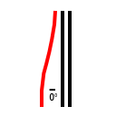</td>
            <td class="bg-white">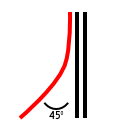</td>
            <td class="bg-white">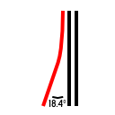</td>
        </tr>
        <tr>
            <td>Type A1</td>
            <td>Type B1</td>
            <td>Type C1</td>
            <td>Type D1</td>
            <td>Type E1</td>
            <td>Type F1</td>
        </tr>
        <tr>
            <td class="bg-white"></td>
            <td class="bg-white">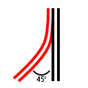</td>
            <td class="bg-white">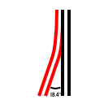</td>
            <td class="bg-white">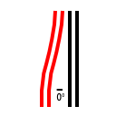</td>
            <td class="bg-white"></td>
            <td class="bg-white"></td>
        </tr>
        <tr>
            <td>Type A2</td>
            <td>Type B2</td>
            <td>Type C2</td>
            <td>Type D2</td>
            <td>Type E2</td>
            <td>Type F2</td>
        </tr>
        <tr>
            <td class="bg-white">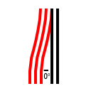</td>
            <td class="bg-white">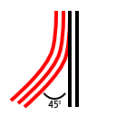</td>
            <td class="bg-white">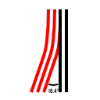</td>
            <td class="bg-white">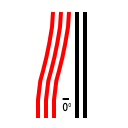</td>
            <td class="bg-white">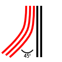</td>
            <td class="bg-white">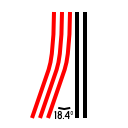</td>
        </tr>
        <tr>
            <td>Type A3</td>
            <td>Type B3 <i>Not available</i></td>
            <td>Type C3</td>
            <td>Type D3</td>
            <td>Type E3 <i>Not available</i></td>
            <td>Type F3 <i>Not available</i></td>
        </tr>
    </table>

* **A1**: Indicates a single-lane (MIS Ramp) branch off the mainline, with an orthogonal branch. No lanes peel off the mainline.
* **B1**: Indicates a single-lane (MIS Ramp) branch off the mainline, with a diagonal branch. No lanes peel off the mainline.
* **C1**: Indicates a single-lane (MIS Ramp) branch off the mainline, with a fractional angle (18.4-degree) branch. No lanes peel off the mainline.
* **D1**: Indicates a single-lane (MIS Ramp) branch off the mainline, with an orthogonal branch. The branch is formed from one lane of the mainline, and the mainline has one fewer lane at the bottom.
* **E1**: Indicates a single-lane (MIS Ramp) branch off the mainline, with a diagonal branch. The branch is formed from one lane of the mainline, and the mainline has one fewer lane at the bottom.
* **F1**: Indicates a single-lane (MIS Ramp) branch off the mainline, splitting at a fractional angle (18.4-degree) from the mainline. The branch is formed from one lane of the mainline, and the mainline has one fewer lane at the bottom.
* **A2**: Indicates a dual-lane (RHW-4) branch off the mainline, with an orthogonal branch. One of the two lanes on the branch is from the mainline, and the mainline has one fewer lane at the bottom.
* **B2**: Indicates a dual-lane (RHW-4) branch off the mainline, with a diagonal branch. One of the two lanes on the branch is from the mainline, and the mainline has one fewer lane at the bottom.
* **C2**: Indicates a dual-lane (RHW-4) branch off the mainline, with a fractional angle (18.4-degree) branch. One of the two lanes on the branch is from the mainline, and the mainline has one fewer lane at the bottom.
* **D2**: Indicates a dual-lane (RHW-4) branch off the mainline, with an orthogonal branch. Both lanes on the branch are from the mainline, and the mainline has two fewer lanes at the bottom.
* **E2**: Indicates a dual-lane (RHW-4) branch off the mainline, with a diagonal branch. Both lanes on the branch are from the mainline, and the mainline has two fewer lanes at the bottom.
* **F2**: Indicates a dual-lane (RHW-4) branch off the mainline, with a fractional angle (18.4-degree) branch. Both lanes on the branch are from the mainline, and the mainline has two fewer lanes at the bottom.
* **A3**: Indicates a triple-lane (RHW-6S) branch off the mainline, with an orthogonal branch. Two of the three lanes on the branch is from the mainline, and the mainline has two fewer lanes at the bottom.
* _**B3**: Indicates a triple-lane (RHW-6S) branch off the mainline, with a diagonal branch. Two of the three lanes on the branch is from the mainline, and the mainline has two fewer lanes at the bottom. There are currently no Type B3 ramps available._
* **C3**: Indicates a triple-lane (RHW-6S) branch off the mainline, with a fractional angle (18.4-degree) branch. Two of the three lanes on the branch is from the mainline, and the mainline has two fewer lanes at the bottom.
* **D3**: Indicates a triple-lane (RHW-6S) branch off the mainline, with an orthogonal branch. All three lanes on the branch are from the mainline, and the mainline has three fewer lanes at the bottom.
* _**E3**: Indicates a triple-lane (RHW-6S) branch off the mainline, with a diagonal branch. All three lanes on the branch are from the mainline, and the mainline has three fewer lanes at the bottom. There are currently no Type E3 ramps available._
* _**F3**: Indicates a triple-lane (RHW-6S) branch off the mainline, with a fractional angle (18.4-degree) branch. All three lanes on the branch are from the mainline, and the mainline has three fewer lanes at the bottom. There are currently no Type F3 ramps available._

Below is a list of the modifiers:

* **Inside**: This designation is seen on ramps from one-way RHW networks, and indicates that the ramp branch is on the inside (left exit/entrance in countries with right-hand traffic, right exit/entrance for those with left-hand traffic), rather than the expected outside.
* **Wide**: This designation indicates that the ramp branch has a larger separation than the standard version of that type, and is most commonly applied to A1 and A2 ramps.
* **Wye**: This designation indicates that both the branch and the mainline (often when the mainline is of the same width as the branch) both diverge from the path of the mainline at the top in a symmetrical fashion, forming a wishbone or Y-shape.
* **Shift**: This is an indication that the mainline undergoes curvature in the midst of the ramp. This occurs when the mainline shifts from an S-type network to a C-type network.
* **Dual**: This is an indication that there are two ramp branches on the ramp interface. This is most commonly seen with the bidirectional networks (RHW-2, RHW-3, and Double-Decker RHWs), or in conjunction with Shift.
* **Folded**: This is an indication that there are two ramp branches that curve off at 90-degree angles, in opposite directions. There is only one Folded ramp interface, the RHW-2 D1 Folded.
* **Diagonal**: This designation indicates that the mainline is diagonal rather than orthogonal. The branch angles are handled the same as if the ramp were orthogonal (i.e. an orthogonal ramp branch off a diagonal ramp interface would still be an A or D-type ramp of some sort).
* **FA**: This designation indicates that the mainline is at a fractional angle rather than orthogonal. The branch angles are handled the same as if the ramp were orthogonal (i.e. an orthogonal ramp branch off an FA ramp interface would still be an A or D-type ramp of some sort).

##### Using FLEXRamps

FLEXRamps are ploppable FLEX on/offramp pieces, and are perhaps the easiest to navigate option to branch ramps off one's RealHighway system. The FLEXRamp pieces may be found under the FLEXRamps button on the Highways menu. To use the FLEXRamps, simply find the desired ramp design, and plop it down. Each FLEXRamp has a default network, but will convert to match if one drags another RHW override network through it, or plops the ramp over an existing stretch of an RHW override network. The process is shown below (the process of overriding the base setup of the Draggable Ramp Interfaces is identical):



Due to the use of special network flags, FLEXRamps are relatively slope-tolerant, particularly compared to other ramp interface options.

Below is a list of the default networks for each FLEXRamp:


| Ramp | Default Network |
| --- | --- |
| Type A1 | RHW-2 |
| Type B1 | RHW-2 |
| Type D1 | RHW-3 |
| Type E1 | RHW-3 |
| Type A2 | RHW-6S |
| Type B2 | RHW-6S |
| Type D2 | RHW-6S |
| Type E2 | RHW-6S |
| Type A3 | RHW-8S |
| Type D3 | RHW-8S |
| Type A1-Inside | MIS Ramp |
| Type B1-Inside | MIS Ramp |
| Type D1-Inside | RHW-4 |
| Type E1-Inside | RHW-4 |


With the wider RHW networks (provided they are supported by the particular FLEXRamp type--see the piece description in game), for most situations, simply align the ramp interface with the shoulder tile for standard ramps, and with the median tile for the inside ramps. If trying to build an RHW-8S Type D2 or E2 setup, however, one should instead align it with the median tile. (Note also that the elevated versions of the RHW-6S do not support Type A1 setups, and the elevated versions of the RHW-8S do not support Type A1 setups, due to the overhang on the RHW-6S network.)

##### Building Draggable Ramp Interfaces (DRIs)

Draggable Ramp Interfaces, or DRIs, are ramp interfaces that are constructed as Pattern-Based Draggables, using the RealHighway network. With the exception of a very few specialized setups, virtually every RHW ramp interface setup can be built through draggable means, and at present, there are some ramps that are only possible as DRIs. Each ramp interface type supported by the system has a special drag pattern, which, when constructed, will subsequently convert into the appropriate on/offramp.

The below Table of DRI Patterns shows the exit ramp (entrance ramp for Left-Hand Traffic) setup. The corresponding entrance (or exit in Left-Hand Traffic) can be constructed by using the mirror image of these patterns. The process for overriding a FLEXRamp to have another RHW network as a mainline is identical to that of the FLEXRamps, as shown above. Elevated ramp interfaces can be constructed by dragging the appropriate elevated RHW network (L1-L4) or double-decker RHW through the DRI, which, provided the particular setup is supported by that network, will elevate the ramp. Many setups for narrower networks can be transformed into corresponding versions for wider networks by using the same method. This conversion is most reliable if the overriding network is dragged into the top end of the mainline.

Since the drag patterns involve the creation of intersections, the point where the actual mainline/branch split occurs will result in flat terrain, but the rest of a DRI is not limited in this regard.

The table below shows all of the basic drag patterns for the DRIs:



##### Older Puzzle Piece Ramp Interfaces

A set of Puzzle Piece Ramp Interfaces also exists. While it was the original method for constructing ramp interfaces, it has largely become a deprecated method, aside from the few setups not covered otherwise, due to the demands it places on the menu system. The Puzzle Piece Ramp Interfaces exist under two buttons, the Puzzle Piece Ramp Interfaces button, and the Fractional Angle Ramp Interfaces button (which contains all the Type C and Type F ramps). One must find the precise puzzle piece needed for the particular setup on the desired network, and place it. As static puzzle pieces, these ramp interfaces cannot carry overrides.

Most (but not all) of the Puzzle Piece Ramp Interfaces have starters attached on their mainline approaches and branches, which does allow one to use them without having to place additional starters, but the presence of these starters also severely limits their slope tolerance. As such, they can generally only be used on flat terrain, or they will end up flattening parts of slopes. If the puzzle-based interface does not have a starter stub on its ends (as it the case with most of the Fractional Angle types), one must place it after constructing the base network, and a portion of the ramp.

##### QuickChange: A Shortcut to Quicker Interchanges

In addition to the ramp interfaces, a series of "shortcuts" exist, in the form of the FLEX-based QuickChange (QC) pieces. The QuickChanges include a base ramp interface (Type A1 by default) with a height transition already attached, and provide quadrants for standard diamond and parclo (partial-cloverleaf) interchanges. To build a QuickChange setup, simply place the desired setup, and as needed, drag an override network through the mainline portion (or plop it over an existing override network), after which point it will change to match.

The QuickChange pieces may be found under the QuickChange button on the Highways menu.



QuickChange still operates with the RealHighway's modular design philosophy in mind, and as such, is possible to swap in a different ramp interface type for the default Type A1 (such as a Type D1), simply by plopping the other ramp interface over the existing one.



##### Tutorial: Simple Diamond Interchange with QuickChange

To build a diamond interchange with the QuickChanges, in which the L1 RHW-4 crosses over a Road, first begin with the L1 RHW-4 Starter Pieces, and drag out with the RealHighway network tool to continue the overrides. Then, drag the Road underneath. Following that, place four QuickChange L1 RHW Partial Diamond pieces encircling the Road. The L1 RHW-2 base mainline of the QuickChanges should covert to match the L1 RHW-4 (if L1 RHW-2 lingers, simply click around the vicinity of the unconverted sections with the RealHighway network tool to get them to cooperate). After this, use the RealHighway network tool to drag between the height transitions, right through the Road. This will form the intersections between the ramps and the Road, thereby completing the interchange.



This process can easily be adapted to other RHW networks, other surface street options (such as Avenues or Network Widening Mod networks), and to variants where the RHW is at ground level, and the surface street crosses over using one of the [Draggable Elevated Road Viaducts](/docs/features/road-viaducts/).

#### Transitioning to Other Networks

There are three types of transitions that exist in the RealHighway plugin: Height Transitions, Width Transitions, and Other Network Transitions. The first two cover cases between two RealHighway networks, while the latter covers transitions to non-RealHighway networks, i.e. Maxis and Network Widening Mod (NWM) networks.

There are two methods of constructing Height Transitions, both of which involve ploppable items: the FLEX-based FLEXHeight system (found under the "FLEXHeight" button), and the conventional puzzle piece approach (found under the "Height Transitions" button, now a "legacy/deprecated" item). The FLEXHeight system is the more full-featured of the two, and vastly exceeds the capabilities of the older puzzle piece form.





There are two subtypes of Height Transitions: "Ramp-Style" and "On-Slope". The former is designed for use on (relatively) level ground, and uses a multi-tile rise to get the RealHighway up to the desired height, and presently exists in an orthogonal version, a (limited) diagonal version, and a (limited) curved version. The latter is for use on an embankment, and exists in an orthogonal version, and a (limited) diagonal form. In order to ensure proper placement on the OnSlope transitions, use of the NAM's [Hole Diggers and Raisers](/docs/feature-guides/base-network/) is recommended.




Using FLEXHeight Transitions with RHW-2:

Even though most FLEXHeight transitions default to the base RHW-2 network, for technical reasons, the pieces **will not** produce an elevated RHW-2 network and it is required to use a starter or connect to an already elevated RHW-2.  For other RHW networks, connecting to the L0 side of the transition will produce the appropriate elevated network on the opposite side.


##### Ramp-Style Usage



##### On-Slope Usage


    images/rhw-flexheight-use-onslope-1.jpg
    images/rhw-flexheight-use-onslope-2.jpg
    images/rhw-flexheight-use-onslope-3.jpg


If using a multi-tile network, simply place multiple FLEXHeight transitions adjacent to one another, and drag each tile of the multi-tile network into the ends of the transition.



On the orthogonal and diagonal transitions, is also possible to transition between two different elevations (i.e. L1 and L2 instead of L0 and L1), simply by plugging the appropriate overrides into the ends.



Additionally, 3-Level and 4-Level Ramp-Style transitions can be built by overlapping the ends of multiple FLEXHeight 1-Level or 2-Level pieces. Note that this can only be done with networks that support the L3 and L4 elevation (the RHW-4, MIS Ramp, and RHW-6S).



The Width Transitions include the new FLEXWidth transition (FLEX-WT) system, as well as the older "legacy/deprecated" puzzle piece-based Width Transitions.

##### FLEXWidth Transitions (FLEX-WT)

With the FLEXWidth transitions, these work similarly to the FLEXHeight transitions. Simply drag the appropriate networks into each end of the transition, which will, as appropriate, convert it to match.



For the large "S-to-C" transitions, due to the design of the FLEX piece, asymmetrical setups are possible. All networks involved in the transition must be at the same height level, and with the exception of the RHW-2-to-4 and RHW-3-to-4 transitions, which are L0/ground-level only, all height levels are available for FLEXWidth transitions.



##### Puzzle Piece Width Transitions 

With the legacy puzzle piece-based Width Transitions, simply find the desired puzzle piece by using TAB/Shift-TAB to cycle through the options, and place it. Most Width Transitions already have starters on the ends--note, however, that this fact significantly limits the slope tolerance of these transitions.



##### Transitions to Non-RHW Networks

Transitions to non-RealHighway networks are accomplished simply by dragging the RealHighway and non-RealHighway network to meet. If the setup is supported, the transition will override to match the involved networks.



A full list of supported transition setups can be found [here](/docs/feature-guides/realhighway-mod/#network-and-flex-piece-capabilities), and a listing of items under the transition-related menu buttons can be found [here](/docs/feature-guides/realhighway-mod/#rhw-transition-menu-items).

### Advanced Curves and FLEXFly

#### Wide-Radius Curves (WRCs) and Multi-Radius Curves (MRCs)

The default draggable curves for the RealHighway networks are not exactly the smoothest or most realistic. The FLEX-based and draggable **Multi-Radius Curves (MRCs)** and the Puzzle Piece-based **Wide-Radius Curves (WRCs)** allow one to change that, by providing smoother curves with wider radii than the defaults. Both the FLEX and puzzle pieces can be found under the RealHighway Curves button on the Highways menu.



##### Multi-Radius Curves (MRCs) [FLEX/Draggable]

The Multi-Radius Curves are a series of wider-radius curves that are constructed through either draggable means or with FLEX pieces. There are five radii total included in the MRC system--R1, R2, R3, R4, and R5, as well as an S-Curve and a Basketweave setup. The higher the number, the wider the radius (i.e. R2 has a wider radius than R1). As with many items, they default to the RHW-2, but they can support up to the RHW-6S width--more details as to precisely what is supported can be found [here](/docs/feature-guides/realhighway-mod/#network-and-flex-piece-capabilities).



R1 curves, also known as "Mini-Curves", are constructed by draggable means, and can be easily constructed with a simple additional motion when building the default network curves. Simply drag in a straight, orthogonal motion through the entire default curve. Afterward, a smoother curve will appear. Alternatively, one can simply try to drag the curve to the diagonal one tile before an end stub, which will also trigger the R1 curve.



Note that with the RHW-6S, due to the overhang, a "bite" may appear to be missing from some curve setups. Simply click in the area of the missing "bite" with the RealHighway network tool to fill it.



R2 45° curves may be constructed either via draggable means or FLEX pieces. For the draggable R2 setup, drag the default curve as usual, and then build a 90° bend on the inside of the curve, at which point it should convert. To build the FLEX piece, simply select it from the menu and place it. The FLEX pieces--which include a 90° variant in addition to the 45° version--all default to the base L0 RHW-2 network, but dragging an override network into a FLEX MRC piece, or plopping one over top of an existing stretch of override network will cause it to convert to match, provided the network is supported for that particular setup.



Note also that the orthogonal ends of R2 curves can, in fact, overlap, allowing for one to create a smooth composite curve, which can be very useful in building aesthetically-pleasing interchange ramps.



The R3, R4, and R5 radii only exist as FLEX pieces, and can be constructed the same way as the R2 FLEX piece. They do not, however, support the overlap/composite curve functionality of the R2 curves.

The Multi-Radius Curves do not support the creation of intersections or crossings at any point in the curve, and attempting to build one will destabilize the curve. The [FLEXFly system](/docs/feature-guides/realhighway-mod/#using-the-flexfly-flexible-flyover-system) does allow for an equivalent functionality, however.

##### Wide-Radius Curves (WRCs) [Puzzle]

In addition to the MRCs, a series of puzzle piece-based Wide-Radius Curves (WRCs) also exists, which at least partially cover all ground-level RealHighway networks. S-Curves exist for all networks, 45° curves exist for all but the RHW-6C and 8C, and 90° curves (in two radii--small and large) exist for the RHW-2 and MIS Ramps.

The Wide-Radius Curve puzzle pieces do **NOT** have starters on their ends, unlike many other older puzzle-based RealHighway items, and being puzzle-based, do not support overrides. As such, they generally must be built on top of an existing stretch of a RealHighway network. The network must already exist up to the point at which the curve piece begins. With S-Curves/Lane Shifts, the presence of base network stubs may allow one to simply place starters oneself on either end.



The S-Curves for the RHW-6C and RHW-8C are built in a modular fashion as well, to allow support for the asymmetrical "RHW-7C" setup. Simply build the full curve one half at a time.



It is possible to also build larger composite 90° turns with the single-tile networks, using the RHW Filler Pieces, but this functionality does not exist for the RHW-8S, 10S, 6C, or 8C.

#### Using the FLEXFly (Flexible Flyover) System

The FLEXFly (Flexible Flyover) pieces are FLEX-based curved flyover ramps, which can be crossed under or over by almost every RealHighway network (**except for the L0 RHW-2**, for the purposes of stability). They can be found under the FLEXFly button on the Highways menu.



The FLEXFly pieces come in two angles--90° and 45°--and both single-lane/MIS Ramp-based or dual-lane/RHW-4-based versions are available, at height levels from L0 to L2. Their curve radii are equivalent to the R2 Multi-Radius Curves.

To use a FLEXFly piece, first place the desired setup. Each FLEXFly will allow draggable orthogonal crossings at any point in the curve, provided the crossing network is at different height level than the FLEXFly itself. To create these crossings, just drag the network under/over the FLEXFly. To continue the flyover ramp, just drag out from the ends of the FLEXFly, just as if it were a starter piece, or connect it to other RealHighway-related items (like height transitions) as desired.



Note that FLEXFly pieces can only support a single crossing network at any given point. In certain situations, such as the first one (with the green checkmark), it is actually possible to cross one FLEXFly over another FLEXFly, though this is strictly limited.  Attempting to build unsupported overlaps, or crossing two networks under one tile of FLEXFly will yield glitched or blank network tiles, as seen in the other three images (with the red circle-and-slash).  Additionally, FLEXFly pieces do not support the overlap/composite technique of the R2 Multi-Radius Curves.


    images/flexfly-overlap-yes.jpg
    images/flexfly-overlap-no1.jpg
    images/flexfly-overlap-no2.jpg
    images/flexfly-overlap-no3.jpg


### Fractional Angle RealHighways (FARHW)

**Note that the current iteration of FARHW is considered "legacy" in the current NAM development paradigm as it is currently only usable via puzzle pieces. This will change in future releases.**

One can also further their "grid-busting" efforts with the RealHighway system with the use of the Fractional Angle RealHighway (FARHW) Puzzle Pieces. The FARHW pieces allow one to build RealHighways at angles other than orthogonal and diagonal--currently, only 18.4°/71.6° (or "FA-3", as it is known in Fractional Angle Network nomenclature).



The FARHW pieces exist under three different buttons--the main FARHW pieces button, which contains the base fractional angle network pieces, and curves to connect to orthogonal and diagonal networks, the FARHW Ramp Interfaces button, which contain ramp interfaces involving FARHW connections (including the Type C1, C2, F1, F2, and C3 ramps), and the FARHW Intersections and Transitions button, which contains intersection pieces with FARHW approaches, as well as width transitions between different FARHW widths.







In building stretches of FARHW, make sure that the line colors (or shoulder widths, if dealing with Euro textures) line up properly.



Note that, with the exception of the FARHW Ramp Interfaces, none of the other FARHW pieces have starters on their ends, much like the Wide-Radius Curves, so one must be sure to place the orthogonal or diagonal ends of curves over an existing stretch of network.

### Cosmetic Pieces

The Cosmetic Pieces are a set of puzzle pieces that are designed to allow one to exercise finer control of the look of their RealHighways, particularly with lane markings, such as auxiliary lane and HOV lane markings. Due to their sheer number (166 total at present), the Cosmetic Pieces are divided under four separate buttons, one for each tile width possibility (1-tile, 2-tile, and 3-tile), and one for cosmetic transitions. All four buttons can be found under the Highways menu.











To use the Cosmetic Pieces, simply find the desired piece and place it. Please note that as puzzle pieces, the Cosmetic Pieces cannot accept or pass along overrides, albeit they can be placed over starter pieces in many situations.

### Bridges

The NAM does include bridges for various RealHighway networks. However, it is worth noting that there are some special caveats, due to a hardcoded restriction in the game's terrain engine, which prevents bridges from being built without at least a one-tile separation between them:

* Bridges involving the wider S-type networks (RHW-8S and RHW-10S) must be built with the _**Maxis Ground Highway**_ tool instead of the RealHighway tool.
* Bridges involving the wider C-type networks (RHW-6C and RHW-8C) are **not possible**.
* There are bridges available for adjacent RHW-4 and RHW-6S situations, also built with the Maxis Ground Highway tool.
* Bridges for RealHighway networks with separate carriageways (i.e. the MIS Ramps, RHW-4, RHW-6S, RHW-8S, RHW-10S, and DDRHW-4) will have their traffic flow determined by the way in which the base network is dragged. Take note of the preview models to ensure you have built the bridge in the correct direction.

For the bridges that use the Maxis Highway as a base, there are overrides in place to seamlessly connect with the otherwise RealHighway-based networks. In order to create this smooth transition, ensure that only the end stub of the Maxis Highway network is showing at each end of the bridge. Then, simply drag each tile of the RealHighway override network into the Maxis Highway stubs. They will convert to match the RealHighway. This process is shown below.



Below is a list of all the bridges presently available. Maxis Ground Highway-based bridges will be marked with a bracketed note. (Click images for full resolution.)

#### RHW-2 Bridges

* Small Steel Arch RHW-2 Bridge
* Plain RHW-2 Bridge
* Concrete Girder RHW-2 Bridge
* V-Shaped Steel Girder RHW-2 Bridge
* L0 RHW-2 Viaduct Bridge
* L1 RHW-2 Viaduct Bridge
* L2 RHW-2 Viaduct Bridge


    images/bridges/rhw2-bridges-1.jpg
    images/bridges/rhw2-viaduct-bridges.jpg


#### RHW-3 Bridges

* L0 RHW-3 Viaduct Bridge
* L1 RHW-3 Viaduct Bridge
* L2 RHW-3 Viaduct Bridge


    images/bridges/rhw3-viaduct-bridges.jpg


#### MIS Ramp Bridges

* L0 MIS Viaduct Bridge
* L1 MIS Viaduct Bridge
* L2 MIS Viaduct Bridge


    images/bridges/mis-viaduct-bridges.jpg


#### RHW-4 Bridges

* Small Steel Arch RHW-4 Bridge
* Plain RHW-4 Bridge
* Steel Girder RHW-4 Bridge
* Concrete Box Girder RHW-4 Bridge
* V-Shaped Steel Girder RHW-4 Bridge
* Dual Steel Girder RHW-4 Bridge (1) [Maxis Ground Highway-based]
* Dual Steel Girder RHW-4 Bridge (2) [Maxis Ground Highway-based]
* Plain Compact Suspension RHW-4 Bridge [Maxis Ground Highway-based]
* Large Steel Arch Compact RHW-4 Bridge [Maxis Ground Highway-based]
* L0 RHW-4 Viaduct Bridge
* L1 RHW-4 Viaduct Bridge
* L2 RHW-4 Viaduct Bridge


    images/bridges/rhw4-bridges-1.jpg
    images/bridges/rhw4-bridges-2.jpg
    images/bridges/rhw4-bridges-3.jpg
    images/bridges/rhw4-bridges-4.jpg


#### RHW-6S Bridges

* Concrete Box Girder RHW-6S Bridge
* Compact Concrete Box Girder RHW-6S Bridge [Maxis Ground Highway-based]
* Compact Regular RHW-6S Bridge [Maxis Ground Highway-based]
* Compact Cable-Stayed RHW-6S Bridge [Maxis Ground Highway-based]
* Compact Steel Arch RHW-6S Bridge [Maxis Ground Highway-based]
* L0 RHW-6S Viaduct Bridge
* L1 RHW-6S Viaduct Bridge
* L2 RHW-6S Viaduct Bridge


    images/bridges/rhw6s-bridges-1.jpg
    images/bridges/rhw6s-bridges-2.jpg
    images/bridges/rhw6s-bridges-3.jpg
    images/bridges/rhw6s-viaduct-bridges.jpg


#### RHW-8S Bridges

* Undertruss RHW-8S Bridge [Maxis Ground Highway-based]
* L0 RHW-8S Viaduct Bridge [Maxis Ground Highway-based]
* L1 RHW-8S Viaduct Bridge [Maxis Ground Highway-based]
* L2 RHW-8S Viaduct Bridge [Maxis Ground Highway-based]


    images/bridges/rhw8s-bridges-1.jpg
    images/bridges/rhw8s-viaduct-bridges.jpg


#### RHW-10S Bridges

* Large Concrete Arch RHW-10S Bridge [Maxis Ground Highway-based]
* Cable Stayed RHW-10S Bridge [Maxis Ground Highway-based]
* Steel Arch RHW-10S Bridge [Maxis Ground Highway-based]
* L0 RHW-10S Viaduct Bridge [Maxis Ground Highway-based]
* L1 RHW-10S Viaduct Bridge [Maxis Ground Highway-based]
* L2 RHW-10S Viaduct Bridge [Maxis Ground Highway-based]


    images/bridges/rhw10s-bridges-1.jpg
    images/bridges/rhw10s-viaduct-bridges.jpg


#### RHW-12S Bridges

* Steel Arch RHW-12S Bridge [Maxis Ground Highway-based]
* L0 RHW-12S Viaduct Bridge [Maxis Ground Highway-based]
* L1 RHW-12S Viaduct Bridge [Maxis Ground Highway-based]
* L2 RHW-12S Viaduct Bridge [Maxis Ground Highway-based]

#### DDRHW-4 Bridges

* Plain DDRHW-4 Bridge


    images/bridges/ddrhw4-bridges-1.jpg


#### RHW-6C Bridges

Not possible due to terrain engine restriction. You will need to switch to 2xRHW-6S before crossing rivers, use one of the 6C-to-6S transition pieces.

#### RHW-8C Bridges

Not possible due to terrain engine restriction. You will need to switch to 2xRHW-8S before crossing rivers, use one of the 8C-to-8S transition pieces.

### Tunnels

The base RealHighway network **does NOT support tunnels**. While certain slope settings may permit a tunnel to appear, it will be completely non-functional, due to hardcoded limitations that prevent traffic from using it. There is no known solution to this limitation at present. The only possible workaround at present is to transition to another network that does support tunnels, or to use the new FLEX/Draggable version of the [Flexible Underpasses and URoads](/docs/feature-guides/flexible-underpasses/).

### Neighbor Connections

While the single-tile, two-way RealHighway networks (the RHW-2, RHW-3, and DDRHW-4) can form functioning neighbor connections the standard way, attempting to do this with any other RealHighway network will result in only freight trucks being able to use the connection. This is because the game cannot handle one-way neighbor connections, as would be required with the RHW-4, MIS, and the various wider networks. As a result, special Neighbor Connectors (NCs) are required, in order to provide proper functionality for these override networks. These can be found under the RHW Neighbor Connector Pieces button.



There are two types of pieces involved in RHW Neighbor Connections: Network Pieces and Invisible Loop Connectors.

To build the Neighbor Connection, build a standard Neighbor Connection through the normal draggable means with the network you wish to use.



Please note that no matter how you drag the RHW to the edge, the default yellow Neighbor Connection will **always be facing the same way**, unlike Avenue or Maxis Highway Neighbor Connections. (There is no way to change this, nor any need to do so.)



Then find the RHW Neighbor Connector button, and place the FLEX Neighbor Connector (FLEX-NC) over each network tile that will be part of the Neighbor Connection, on the the game's default yellow Neighbor Connection arrows. After that, simply drag the network through the FLEX-NC to connect it.



If the two sides of your RHW are separated by one or more tiles, place the Invisible Loop Connectors in the median area right next to the edge of the city tile, filling the gap. The Invisible Loop Connectors, which look like a blue arrow with an "N" inside, when placed, will show up invisible, but you can easily locate them by hovering a query tool over top, which will cause an otherwise invisible "ghost model" with the blue "N" arrow to appear:



Do **not** place the Invisible Loop Connectors directly over top of you network, as this is not what they were intended for and they will actually prevent your system from working. Due to how the pieces have to be set up, it is also possible you will see "spider cars" going down the edge of your city tile, and the paths will be draped over the edge of the city tile.



For "Combined" ("C-type") networks, such as the RHW-6C and 8C, simply place the FLEX-NC over top of the network at the edge of the city tile, and then drag the RHW-C network through it.

In order for the connection to work properly, this process must be repeated identically in the neighboring city tile, and the traffic simulation must be given some time to run in both involved city tiles in order for the game to recognize that there is a valid connection.

_NOTE: With the addition of the FLEX Neighbor Connectors in NAM 42, all elevated networks are now supported._

### Specialised Network Crossings and Interchanges

The RealHighway system includes the ability to recreate three oft-requested interchange designs: the Single-Point Urban Interchange (SPUI), the Diverging Diamond Interchange (DDI), and the Volleyball Interchange. These are "advanced" features of the plugin, and it is recommended that you are already comfortable with the RealHighways, the NAM Elevated Viaducts and the either the FLEX Turn Lanes (FTL) or Turn Lane Extension Pieces (TuLEPs) before trying to build SPUIs or DDIs.

The SPUI and DDI setups can be found under the RHW/Avenue Interface button on the Roads menu, while the Volleyball pieces can be found under the old puzzle-based Ramps button on the Highways menu.





#### Single-Point Urban Interchange (SPUI)

The RealHighway system includes the ability to recreate three oft-requested interchange designs: the Single-Point Urban Interchange (SPUI), the Diverging Diamond Interchange (DDI), and the Volleyball Interchange. These are "advanced" features of the plugin, and it is recommended that you are already comfortable with the RealHighways, the NAM Elevated Viaducts and the either the FLEX Turn Lanes (FTL) or Turn Lane Extension Pieces (TuLEPs) before trying to build SPUIs or DDIs.

The SPUI and DDI setups can be found under the RHW/Avenue Interface button on the Roads menu, while the Volleyball pieces can be found under the old puzzle-based Ramps button on the Highways menu.

_NOTE: FlexSPUI was upgraded and redesigned for NAM 37, to provide proper support for newer RHW networks. The screenshots here show the previous version of FlexSPUI, which has a slightly different footprint, but the underlying construction process is identical._

In order to build a SPUI, place the FlexSPUI piece--it looks like half of a SPUI.



To complete the basic intersection, you'll need to plop another half of a SPUI. This half can be plopped next to the first one:



Or you can put a small gap between them and fill it in with an Avenue:





In either case, make sure to bulldoze the "construction site handles" on the piece. The ramp connections on the sides allow RHW-4 to be dragged out from them:



You can simply drag an elevated RHW over top of the FlexSPUI, like so:



In order to connect the Avenue end, use the either the Avenue Type 110 FLEX Turn Lanes or Turn Lane Extension Pieces:



It is also possible to elevate the FlexSPUI. Simply place an L2 connection (such as a transition) next to the ramp connection on the SPUI (_NOTE: L1 did not exist when FlexSPUI was created_). Most of one half of it will become elevated--simply click on the non-elevated part with the RHW network tool and it will raise up:





The overrides are most stable on the "incoming" part of the ramp connection ("outgoing" in Left-Hand Drive)--this shows the rest of the SPUI becoming elevated:



You can simply drag a ground-level RHW underneath the Elevated FlexSPUI, much as you dragged the Elevated RHW over the Ground FlexSPUI:



In order to connect the Avenue end, you will need to use the Avenue Type A On-Slope TuLEP. The NAM's [Hole Digger and Raiser](/docs/feature-guides/base-network/#raiser-digger) feature is highly recommended in order to get the embankment to the proper elevation.

For a video demonstration of FlexSPUI construction, please see Tarkus' YouTube videos on [Ground FlexSPUI](http://www.youtube.com/watch?v=Yd9MumOT9Po) and [Elevated FlexSPUI](http://www.youtube.com/watch?v=3UGIFwgkHWY).

#### Diverging Diamond Interchange (DDI)

The Diverging Diamond Interchange (DDI), sometimes also called "Crossing Diamond", is an interchange that originated in France, but has recently caught on with North American highway engineers, through the work of American traffic engineer Gilbert Chlewicki. The Missouri Department of Transportation (MODOT) opened the first in the United States in Springfield on June 21, 2009. Since then, many more have opened up across the world. The DDI involves having traffic cross onto the "wrong" side of the road, which allows left turn movements flow more smoothly and traffic onto (and sometimes off) the freeway to go unsignalized, with only the through movements on the surface street requiring signalization.

The RHW includes a special puzzle piece allowing for the construction of a DDI with an Avenue, which, like the FlexSPUI, is found under the RHW x Avenue button on the Roads menu. To build a DDI, place the special DDI intersection pieces on either side of your RHW, and connect Avenues into the appropriate ends of the pieces. Use One-Way Roads and/or the draggable or puzzle piece-based [Elevated One-Way Road Viaducts](../road-viaducts/) (for an elevated DDI) to build the "wrong side" traffic sections between the DDI intersection pieces. The connections to the RHW end are made via RHW-4.



#### Volleyball Interchange

The Volleyball Interchange, also commonly known as a Three-Level Diamond, or Split-Level Diamond, is a three-level interchange, in which all turning motions are handled by at-grade intersections on a separate height level from through traffic.

Under the old Puzzle Piece Ramp Interfaces button on the Highways menu, one can find a series of "Specialized Crossing Pieces" (SCPs) to handle Volleyball Interchange intersections. To use them, simply place them down, and place starter pieces between each intersection to connect them.



#### Three-Level Crossings

In certain situations, using special Three-Level Crossing helper pieces (located under the RHW 3-Level Crossings button), it is possible to have three different RHW elevations cross one another on a single tile, which can be useful in constructing more complex interchanges, such as compact T-Interchanges and Stack Interchanges. To use the Three-Level Crossings, connect two different height levels of diagonal network, and the desired width of mainline at a third height level. It is recommended to use the 2-Tile version for the RHW-4 and RHW-6S, the 3-Tile version for the RHW-6C and RHW-8C, and the 4-Tile version for the RHW-8S and RHW-10S.

Note that any FLEXFly or curve pieces must be _at least 1 tile away_ from a Three-Level Crossing FLEX Piece, as at present, the adjacency stability does not exist, nor does FLEXFly-over-FLEXFly functionality.


images/tlc/rhw-tlc-1.jpg
images/tlc/rhw-tlc-2.jpg
images/tlc/rhw-tlc-3.jpg
images/tlc/rhw-tlc-4.jpg
images/tlc/rhw-tlc-5.jpg
images/tlc/rhw-tlc-6.jpg
images/tlc/rhw-tlc-7.jpg
images/tlc/rhw-tlc-8.jpg


The "Stackasaurus Rex" Interchange, built by NAM Team developer Lucario Boricua, is an example of what is possible with the Three-Level Crossings.



#### RHW FLEX Turn Lanes (FTLs)

The RHW has its own set of (rapidly-expanding) FLEX Turn Lane (FTL) options available. Supported types include the RHW-2 (L0 only), RHW-4 Rural (L0 only), and MIS Ramps (L0 and L1). Support for [SITAP-style signalized intersections](/docs/feature-guides/turning-lanes/#sitap) is also available in at least some instances.

To build the RHW-2 FTLs, begin with the transition, and drag RHW-2 out from it. The override of the turn lane will carry until you reach an intersection with another network.


images/ftl/rhw-ftl-rhw2-1.jpg
images/ftl/rhw-ftl-rhw2-2.jpg
images/ftl/rhw-ftl-rhw2-3.jpg
images/ftl/rhw-ftl-rhw2-4.jpg


The override does not continue on the other side of the intersection, if a +-intersection is made, so one must place another transition and build the same setup on the other side.



It is possible to signalize intersections with Roads and other RHW-2s, via two methods: the first involves transitioning to Road immediately before the intersection (as is the case with the draggable signalized One-Way Road intersections in SITAP).


images/ftl/rhw-ftl-rhw2-6.jpg
images/ftl/rhw-ftl-rhw2-7.jpg
images/ftl/rhw-ftl-rhw2-8.jpg


The second involves using one of the RHW FLEX SITAP intersections in the back half of the RHW FLEX Turn Lanes TAB Loop, placing it, and then reconnecting all the networks.



In the case of T-intersections, in which the RHW-2 is the thru network, use the T-Median transition on the opposite side.



Currently, the only crossing networks supported by the RHW-2 FTLs are Streets, Roads (with and without SITAP), and other RHW-2s (both with and without FTLs, and with and without SITAP).

To build rural-style RHW-4 FTLs, use the same transition as the RHW-2 FTLs, but override it with the RHW-4 network to convert it.


images/ftl/rhw-ftl-rhw4-1.jpg
images/ftl/rhw-ftl-rhw4-2.jpg
images/ftl/rhw-ftl-rhw4-3.jpg
images/ftl/rhw-ftl-rhw4-4.jpg


Situations in which the RHW-4 FTLs are adjacent (or separated only by a single tile median) are possible. (Note that the Rural RHW-4 FTLs are presently the least-developed of the set, and may have instabilities, particularly involving more exotic T-intersections.)



Currently, the only crossing networks supported by the Rural RHW-4 FTLs are Streets (+ and limited T), Roads (with and without SITAP, + and limited T), and RHW-2 (without FTLs, and with or without SITAP, + and limited T).

The MIS FTLs, known in their 2-lane form as "MIS-2", currently come in two flavors: one that favors right turns, and the other that favors left turns. Each produces a different end result at a Road +-intersection (with SITAP support).


images/ftl/rhw-ftl-mis-1.jpg
images/ftl/rhw-ftl-mis-2.jpg
images/ftl/rhw-ftl-mis-3.jpg


It is also possible to hook an RHW-4 into an MIS FTL, in which case the RHW-4 seamlessly transitions into an MIS-2 FTL.


images/ftl/rhw-ftl-mis-4.jpg
images/ftl/rhw-ftl-mis-5.jpg


Additionally, combination FLEX Height/Turn Lane transitions exist, allowing more flexibility when adding turn lanes to ramps in interchanges.



Currently, the only crossing networks supported by the MIS-2 FTLs are Roads (with and without SITAP, + and T), One-Way Roads (with SITAP, + and T), Avenues (with and without SITAP, + and T), Type 110 Road/NWM FTLs (with and without SITAP, +-only), Type 120 Avenue/NWM FTLs (with and without SITAP, +-only), Type 130 NWM FTLs (with and without SITAP, +-only), L1 Road (with and without SITAP, + and T), L1 Avenue (without SITAP, +-only), and two intersection types currently only used by the QuickChange Xpress interchanges: Dual Type 110 Road/NWM FTLs, and Dual Type 120 Avenue/NWM FTLs.

## Network and FLEX Piece Capabilities

> Refer to [the RealHighway mod technical document](/docs/tech-specs/realhighway-mod) to see what the RealHighway mod is capable of.

## List of Menu Items

### RHW Network Menu Items

#### RHW-2 Base Network



This button activates the base draggable RealHighway network tool, which defaults to the RHW-2 network. The use of Starter and various FLEX pieces can initiate overrides, transforming the RHW-2 into other networks.

#### RHW Starters



The Starter Pieces allow one to widen and/or elevate their RealHighways, by dragging the base RealHighway network tool through them, causing them to convert to match.

1. L0 RHW-4 Starter
2. L0 MIS Starter
3. L0 RHW-3 Starter
4. L0 RHW-6S Starter
5. L0 RHW-6C Starter
6. L0 RHW-8S Starter
7. L0 RHW-8C Starter
8. L0 RHW-7C Starter
9. L0 RHW-10S Starter
10. L0 RHW-12S Starter
11. L1 RHW-2 Starter
12. L1 RHW-4 Starter
13. L1 MIS Starter
14. L1 RHW-3 Starter
15. L1 RHW-6S Starter
16. L1 RHW-6C Starter
17. L1 RHW-8S Starter
18. L1 RHW-8C Starter
19. L1 RHW-7C Starter
20. L1 RHW-10S Starter
21. L1 RHW-12S Starter
22. L2 RHW-2 Starter
23. L2 RHW-4 Starter
24. L2 MIS Starter
25. L2 RHW-3 Starter
26. L2 RHW-6S Starter
27. L2 RHW-6C Starter
28. L2 RHW-8S Starter
29. L2 RHW-8C Starter
30. L2 RHW-7C Starter
31. L2 RHW-10S Starter
32. L2 RHW-12S Starter
33. L3 RHW-4 Starter
34. L3 MIS Starter
35. L3 RHW-6S Starter
36. L4 RHW-4 Starter
37. L4 MIS Starter
38. L4 RHW-6S Starter
39. DDRHW-4 Starter

#### RHW Fillers



The Filler Puzzle Pieces exist for ease of use in tight spaces, where overrides break down and the use of a starter is not feasible. Note that the RHW-8S, 10S, 6C, and 8C do not have diagonal fillers.

1. L0 RHW-4 Filler Piece
2. L0 Diag RHW-4 Filler Pieces (A and B)
3. L0 WRHW-2 Filler Piece
4. L0 MIS Filler
5. L0 Diag MIS Filler Pieces (A and B)
6. L0 RHW-3 Filler
7. L0 Diag RHW-3 Filler Pieces (A and B)
8. L0 RHW-6S Filler
9. L0 Diag RHW-6S Filler Pieces (A and B)
10. L0 RHW-6C Filler
11. L0 RHW-8S Filler
12. L0 RHW-8C Filler
13. L0 RHW-7C Filler
14. L0 RHW-10S Filler
15. L1 RHW-2 Filler
16. L1 RHW-4 Filler
17. Diag L1 RHW-4 Filler Pieces (A and B)
18. L1 MIS Filler
19. Diag L1 MIS Filler Pieces (A and B)
20. L1 RHW-3 Filler
21. Diag L1 RHW-3 Filler Pieces (A and B)
22. L1 RHW-6S Filler
23. Diag L1 RHW-6S Filler Pieces (A and B)
24. L1 RHW-6C Filler
25. L1 RHW-8S Filler
26. L1 RHW-8C Filler
27. L1 RHW-7C Filler
28. L1 RHW-10S Filler
29. L2 RHW-2 Filler
30. L2 RHW-4 Filler
31. Diag L2 RHW-4 Filler Pieces (A and B)
32. L2 MIS Filler
33. Diag L2 MIS Filler Pieces (A and B)
34. L2 RHW-3 Filler
35. Diag L2 RHW-3 Filler Pieces (A and B)
36. L2 RHW-6S Filler
37. Diag L2 RHW-6S Filler Pieces (A and B)
38. L2 RHW-6C Filler
39. L2 RHW-8S Filler
40. L2 RHW-8C Filler
41. L2 RHW-7C Filler
42. L2 RHW-10S Filler
43. L3 RHW-4 Filler
44. Diag L3 RHW-4 Filler Pieces (A and B)
45. L3 MIS Filler
46. Diag L3 MIS Filler Pieces (A and B)
47. L3 RHW-6S Filler
48. Diag L3 RHW-6S Filler Pieces (A and B)
49. L4 RHW-4 Filler
50. Diag L4 RHW-4 Filler Pieces (A and B)
51. L4 MIS Filler
52. Diag L4 MIS Filler Pieces (A and B)
53. L4 RHW-6S Filler
54. Diag L4 RHW-6S Filler Pieces (A and B)
55. DDRHW-4 Filler
56. Diag DDRHW-4 Filler Pieces (A and B)

### RHW Ramp & Interchange Menu Items

#### QuickChange Xpress Pieces



The QuickChange Xpress button offers pre-constructed full interchanges, in FLEX format. For more details, see the [QuickChange portion of this document](/docs/feature-guides/realhighway-mod/#quickchange-xpress-full-interchanges-in-a-click).

1. QuickChange L0 Dual Type 110 (Road)/L1 RHW
2. QuickChange L1 Dual Type 110 (Road)/L0 RHW
3. QuickChange L0 Dual Type 120 (Avenue)/L1 RHW
4. QuickChange L1 Dual Type 120 (Avenue)/L0 RHW
5. QuickChange L0 Dual Type 230 (AVE-6)/L1 RHW
6. QuickChange L1 Dual Type 230 (AVE-6)/L0 RHW

#### QuickChange Pieces



The QuickChange Pieces offer pre-constructed quadrants of full interchanges, in FLEX format. For more details, see the [QuickChange portion of this document](/docs/feature-guides/realhighway-mod/#quickchange-xpress-full-interchanges-in-a-click).

1. QuickChange L0/L1 Diamond
2. QuickChange L1/L0 Diamond
3. QuickChange L0/L1 Parclo-Inner
4. QuickChange L1/L0 Parclo-Inner

#### RHW FLEXRamps



The FLEXRamps offer an easy way to have on/offramps branch off one's RealHighways. Being FLEX pieces, a single piece can work for multiple networks. For more details, see the [FLEXRamps portion of this document](/docs/feature-guides/realhighway-mod/#flexramps). To access diagonal versions (available for A1, B1, D1, and E1 ramps), simply rotate the piece with Home/End until the piece rotates appropriately.

1. Type A1 FLEXRamp
2. Type B1 FLEXRamp
3. Type D1 FLEXRamp
4. Type E1 FLEXRamp
5. Type A2 FLEXRamp
6. Type B2 FLEXRamp
7. Type D2 FLEXRamp
8. Type E2 FLEXRamp
9. Type A1-Diagonal FLEXRamp
10. Type B1-Diagonal FLEXRamp
11. Type A1-Inside FLEXRamp
12. Type B1-Inside FLEXRamp
13. Type D1-Inside FLEXRamp
14. Type E1-Inside FLEXRamp
15. Type D1-Inside Dual Shift FLEXRamp
16. Type A3 FLEXRamp
17. Type D3 FLEXRamp

#### RHW Old Puzzle Piece Ramps 



These puzzle pieces allow you to connect your RHW system through grade-separated interchanges to your surface street (Road, Avenue, One-Way Road) system, or to connect with other RHWs. Types A, B, D and E are located under this button, while Type C and F are located under the Fractional Angle RHW button. The Volleyball Specialized Crossing Pieces are also located here, in the non-deprecated section at the beginning of the TAB Ring. Note that aside from a few specialized setups, the pieces under this button are largely deprecated, and the use of FLEXRamps or DRIs will offer better functionality.

1. RHW-3 Type A1/Type B1 Dual
2. RHW-6C Type D1 Dual Shift
3. RHW-8S Type D1 Dual Shift
4. RHW-6C Type D1 Dual Inside Shift
5. Diagonal RHW-6C Type A1
6. RHW-10S Type D2
7. RHW-10S Type E2
8. Type 4-A1 Volleyball Intersection
9. Type 4-D1 Volleyball Intersection
10. Type 4-A2A Volleyball SCP
11. Type 4-A2B Volleyball SCP
12. Type 4-A2C Volleyball SCP
13. RHW-4 Type A1 
14. RHW-4 Type A1 Diagonal 
15. RHW-4 Type B1 
16. RHW-4 Type B1 Diagonal 
17. RHW-4 Type A1 Inside 
18. RHW-4 Type A1 Wide 
19. RHW-4 Type D1 
20. RHW-4 Type E1 
21. RHW-4 Type E1 Wye 
22. ERHW-4 Type A1 
23. ERHW-4 Type A1 Inside 
24. RHW-3 Type A1 
25. RHW-3 Type B1 
26. RHW-2 Type A1 
27. RHW-2 Type A1 Dual 
28. RHW-2 Type B1 
29. RHW-2 Type B1 Dual 
30. RHW-2 Type D1 
31. RHW-2 Type D1 Wye 
32. RHW-2 Type D1 Folded 
33. RHW-2 Type E1 
34. RHW-2 Type E1 Wye 
35. ERHW-2 Type A1 
36. RHW-6S Type A1 
37. RHW-6S Type B1 
38. RHW-6S Type A1 Wide 
39. RHW-6S Type D1 
40. RHW-6S Type E1 
41. RHW-6S Type A2 
42. RHW-6S Type B2 
43. ERHW-6S Type D1 
44. RHW-6C Type A1 
45. RHW-6C Type B1 
46. RHW-8S Type A1 
47. RHW-8S Type B1 
48. RHW-8S Type D1 
49. RHW-8S Type E1 
50. RHW-8S Type D2 
51. RHW-8S Type E2 
52. RHW-8C Type A1 
53. RHW-8C Type B1 
54. RHW-8C Type D1 
55. RHW-8C Type E1 
56. RHW-10S Type A1 
57. RHW-10S Type B1 
58. RHW-10S Type D1 
59. RHW-10S Type E1 
60. DDRHW-4 Type A1 

### RHW Transition Menu Items

#### RHW FLEXHeight Transitions



These FLEX pieces allow you to transition to a different elevation with your RealHighway networks. The "1-Level" and "2-Level" setups can be used with any network, while the 180° MIS Curve will only work with the L0 and L1 MIS.

1. FlexHeight 1-Level Orthogonal
2. FlexHeight 1-Level Diagonal
3. FlexHeight 2-Level Orthogonal
4. FLEXOnSlope 1-Level Orthogonal
5. FLEXOnSlope 2-Level Orthogonal
6. FLEXOnSlope 1-Level Diagonal
7. FLEXOnSlope 2-Level Diagonal
8. FlexHeight 1-Level 90-Degree Transition
9. FlexHeight MIS 1-Level 180-Degree Transition
10. FlexHeight 1-Level R3 45-Degree Transition (Orthogonal Lower/Diagonal Higher)
11. FlexHeight 1-Level R3 45-Degree Transition (Orthogonal Higher/Diagonal Lower)

#### RHW FLEXWidth Transitions

These FLEX pieces allow you to transition to a different width with your RealHighway networks (presently Orthogonal-only).

1. FLEXWidth Transition for Same Network Type (S-to-S or C-to-C)
2. FLEXWidth Transition for Same Network Type/Tile Drop
3. FLEXWidth Transition for Different Network Type (S-to-C) Asymmetrical
4. FLEXWidth Transition for Different Network Type (S-to-C) Symmetrical/Wishbone
5. FLEXWidth Transition for RHW-2/3-to-4 (and Dual RHW-4 to DDRHW-4) Asymmetrical
6. FLEXWidth Transition for RHW-2/3-to-4 (and Dual RHW-4 to DDRHW-4) Symmetrical/Wishbone

#### RHW Old Height Transition Puzzle Pieces 



These older puzzle pieces allow for transitions between two different height levels of RHW networks. They generally have starter drag end stubs. Use of the FLEXHeight Transitions is generally recommended instead, as they support more networks.

1. RHW-2-to-RHW-4 Transition A
2. RHW-2-to-RHW-4 Transition B
3. RHW-4-to-RHW-6S Transition Style A
4. RHW-6-to-8 Transition Style A
5. RHW-8-to-10 Transition Style A
6. RHW-4-to-6C Transition
7. RHW-6C-to-6S Transition A
8. RHW-6C-to-6S Transition B
9. RHW-6C to RHW-8C transition
10. RHW-6C-to-8 Transition
11. MIS-to-RHW-4 Transition
12. RHW-2-to-3 Transition
13. RHW-2-to-WRHW-2 Transition
14. WRHW-2-to-RHW-3 Transition
15. RHW-3-to-RHW-4 Transition A1/A2
16. RHW-3-to-RHW-4 Transition B1/B2
17. RHW-4 Ground-to-Elevated ON
18. RHW-4 Ground-to-Elevated OFF
19. RHW-4 Ground-to-Elevated On-Slope ON
20. RHW-4 Ground-to-Elevated On-Slope OFF
21. RHW-6S Ground-to-Elevated ON/OFF
22. RHW-6S Ground-to-Elevated On-Slope ON/OFF
23. MIS Ground-to-Elevated L2 ON
24. MIS Ground-to-Elevated L2 OFF
25. MIS Ground-to-Elevated L2 On-Slope ON
26. MIS Ground-to-Elevated L2 On-Slope OFF
27. RHW-2 Ground-to-Elevated L2
28. RHW-2 Ground-to-Elevated L2 T On-Slope
29. RHW-2 Ground-to-Elevated L2 On-Slope
30. RHW-6C Ground-to-Elevated L2
31. RHW-6C Ground-to-Elevated L2 On-Slope
32. MIS Ground-to-Elevated L2 Curved ON
33. MIS Ground-to-Elevated L2 Curved OFF
34. MIS Ground-to-Elevated L2 Curved ON Starterless
35. MIS Ground-to-Elevated L2 Curved OFF Starterless
36. L2-ERHW-4 to L3-ERHW-4 transition Starterless
37. RHW-4 Ground-to-Mid-Elevated L3 Starterless
38. MIS L2-to-L3 Starterless
39. MIS Ground-to-Mid-Elevated L3 Starterless

#### RHW Width Transitions 



These puzzle pieces allow for transitions between two different widths of RHW networks. They generally have starter drag end stubs. The transition allowing the DDRHW-4 to connect to the L1 and L2 RHW-4 is located here as well (as it entails a change of tile width).

1. RHW-2-to-RHW-4 Transition A
2. RHW-2-to-RHW-4 Transition B
3. RHW-4-to-RHW-6S Transition Style A
4. RHW-6-to-8 Transition Style A
5. RHW-8-to-10 Transition Style A
6. RHW-4-to-6C Transition A
7. RHW-4-to-6C Transition B
8. RHW-6C-to-6S Transition A
9. RHW-6C-to-6S Transition B
10. RHW-8S to RHW-8C Symmetrical Transition
11. RHW-8S to RHW-8C Compact Transition
12. RHW-6C to RHW-8C transition
13. RHW-6C-to-8S Transition
14. RHW4-to-MIS Transition
15. RHW-2-to-3 Transition
16. RHW-2-to-WRHW-2 Transition
17. WRHW-2-to-RHW-3 Transition
18. RHW-3-to-RHW-4 Transition A1/A2
19. RHW-3-to-RHW-4 Transition B1/B2
20. L1 RHW-4-to-RHW-6S Transition Style A
21. L1 RHW-6S-to-8S Transition Style A
22. L1 RHW-8S-to-10S Transition Style A
23. L1 RHW-6C-to-8C Transition
24. L1 RHW4-to-MIS Transition
25. L2 RHW-4-to-RHW-6S Transition Style A
26. L2 RHW-6S-to-8S Transition Style A
27. L2 RHW-8S-to-10S Transition Style A
28. L2 RHW-6C-to-8C Transition
29. L2 RHW4-to-MIS Transition
30. DDRHW-4-to-Dual-RHW-4 (L1/L2) Connector

### RHW Curves & FLEXFly Menu Items

#### FLEXFly



These FLEX pieces allow for construction of flyover ramps.

1. FLEXFly MIS L0 90-Degree (Type A1)
2. FLEXFly MIS L0 90-Degree (Type A2)
3. FLEXFly MIS L0 45-Degree (Type B1)
4. FLEXFly MIS L0 45-Degree (Type B2)
5. FLEXFly MIS L1 90-Degree (Type A1)
6. FLEXFly MIS L1 90-Degree (Type A2)
7. FLEXFly MIS L1 45-Degree (Type B1)
8. FLEXFly MIS L1 45-Degree (Type B2)
9. FLEXFly MIS L2 90-Degree (Type A1)
10. FLEXFly MIS L2 90-Degree (Type A2)
11. FLEXFly MIS L2 45-Degree (Type B1)
12. FLEXFly MIS L2 45-Degree (Type B2)
13. FLEXFly RHW-4 L0 90-Degree (Type A1)
14. FLEXFly RHW-4 L0 90-Degree (Type A2)
15. FLEXFly RHW-4 L0 45-Degree (Type B1)
16. FLEXFly RHW-4 L0 45-Degree (Type B2)
17. FLEXFly RHW-4 L1 90-Degree (Type A1)
18. FLEXFly RHW-4 L1 90-Degree (Type A2)
19. FLEXFly RHW-4 L1 45-Degree (Type B1)
20. FLEXFly RHW-4 L1 45-Degree (Type B2)
21. FLEXFly RHW-4 L2 90-Degree (Type A1)
22. FLEXFly RHW-4 L2 90-Degree (Type A2)
23. FLEXFly RHW-4 L2 45-Degree (Type B1)
24. FLEXFly RHW-4 L2 45-Degree (Type B2)

#### RHW Curves



These pieces allow you to build smoother curves.

1. FLEX-MRC R2 45
2. FLEX-MRC R2 90
3. FLEX-MRC R3 45
4. FLEX-MRC R4 45
5. FLEX-MRC R5 45
6. FLEX S-Curve
7. FLEX Basketweave
8. RHW-4 Double Curve
9. RHW-4 Outer Curve
10. RHW-4 Inner Curve
11. RHW-4 Lane Shift
12. RHW-4 Dual Lane Shift
13. MIS S-Curve 1
14. MIS 45-Curve 1
15. MIS 45-Curve 2
16. MIS 90-Curve
17. RHW-2 S-Curve
18. RHW-2 45-Curve
19. RHW-2 90-Curve (Large)
20. RHW-2 90-Curve (Small)
21. RHW-3 S-Curve 1
22. RHW-3 S-Curve 2
23. RHW-3 45-Curve 1
24. RHW-3 45-Curve 2
25. RHW-6S Single Lane Shift
26. RHW-6S Dual Lane Shift
27. RHW-6S Outer Curve
28. RHW-6S Inner Curve
29. RHW-8S Outer Curve
30. RHW-8S Inner Curve
31. RHW-6C S-Curve Half
32. RHW-8C S-Curve Half
33. RHW-10 Outer Curve
34. RHW-10 Inner Curve

### Fractional Angle RHW Menu Items

#### FARHW Puzzle Pieces 



These pieces allow one to build RHW networks at fractional angles (18.4°/71.6°) in puzzle piece form.

1. FARHW-2 Straight
2. FARHW-2 Short Curve
3. FARHW-2 Long Curve
4. FARHW-2 Diagonal to FARHW-2 Curve
5. FARHW-4
6. Dual FARHW-4
7. FARHW-4 Short Curve outer
8. FARHW-4 Short Curve inner
9. Dual FARHW-4 Short Curve
10. FARHW-4 to Diag Curve outer
11. FARHW-4 to Diag Curve inner
12. Dual FARHW-4 to Diag Curve
13. FARHW-6S Short Curve outer
14. FARHW-6S Short Curve inner
15. FARHW-6S
16. FARHW-6S to Diag Curve outer
17. FARHW-6S to Diag Curve inner
18. FARHW-6C Short Curve
19. FARHW-6C to Diagonal RHW-6C Curve
20. FARHW-6C Half Straight Piece
21. FARHW-8C Short Curve
22. FARHW-8C to Diagonal RHW-8C Curve
23. FARHW-8C Half Straight Piece
24. FAMIS-1
25. FAMIS-FAMIS 143deg Curve
26. FAMIS Short Curve outer
27. FAMIS Short Curve inner
28. FAMIS to Diag Curve inner
29. FAMIS to Diag Curve outer
30. FAMIS Long Curve small outer
31. FAMIS Long Curve small inner

#### FARHW Ramp Puzzle Pieces 



These pieces allow one to build the Type C and Type F ramp interfaces, in puzzle piece form.

1. RHW-2 Type C1
2. RHW-2 Type C1 Dual
3. RHW-4 Type C1
4. RHW-4 Type C1 Inside
5. RHW-4 Type C1 diagonal
6. RHW-4 Type F1
7. RHW-4 Type F1 diagonal
8. RHW-6S Type C1
9. RHW-6S Type C1 diagonal
10. RHW-6S Type C2
11. RHW-6S Type F1
12. RHW-6S Type F1 diagonal
13. RHW-6C Type C1
14. RHW-6S Type F2
15. RHW-8S Type C1
16. RHW-8S Type F1
17. RHW-8C Type F1
18. RHW-8S Type C2
19. RHW-8C Type C2
20. RHW-8S Type F2
21. RHW-10S Type F1
22. RHW-10S Type C2
23. RHW-10S Type F2
24. RHW-10S Type C3
25. MIS/FAMIS Ramp Type C1 - out
26. Avenue Type C1 RHW-MIS Exit/Entrance Ramp

#### FARHW Intersection Puzzle Pieces 



These pieces allow one to build width transitions and intersections involving Fractional Angle RealHighways (FARHWs), in puzzle piece form.

1. FA MIS-to-RHW-4 Trans A
2. FA MIS-to-RHW-4 Trans B
3. Fractional Angle Diamond M4A Full (arranged in increasing width)
4. Fractional Angle Diamond 44A Full
5. Fractional Angle Diamond 44B Full
6. Fractional Angle Diamond 64B Full
7. Fractional Angle Diamond M4 TuLEPless Full (also arranged in increasing width)
8. Fractional Angle Diamond 44 TuLEPless Full
9. Fractional Angle Diamond 44A Halves
10. Fractional Angle Diamond M2A Full

### Cosmetic Piece Menu Items

These pieces allow you to manipulate the appearance of your RHW networks and transitions with fine control.

#### 1 Tile Cosmetic Pieces



1. RHW-2 CP Dash Orth
2. RHW-2 CP SolDash Dash Orth
3. RHW-2 CP Dash LRA Dash Orth
4. RHW-2 CP Dash Diag
5. RHW-2 CP SolDash Diag
6. RHW-2 CC Dash S-curve
7. RHW-2 CC Dash 45-curve
8. RHW-2 CC Dash 90-curve
9. RHW-2 CC Dash 18-curve
10. RHW-2 CC Dash 72-curve
11. RHW-2 CC Dash 27-curve
12. RHW-2 CC FARHW Dash
13. RHW-2 CCFARHW SolDash1
14. RHW-2 CC Curve SolDash2
15. RHW-3 CP RM LRA IN
16. RHW-3 CP RM TpA OUT 1
17. RHW-3 CP RM TpA OUT 2
18. RHW-3 CP BM1 UM
19. RHW-3 CP BM1 LRA IN
20. RHW-3 CP BM1 EA
21. RHW-3 CP BM1 EA + TrA
22. RHW-3 CP DS1 UM
23. RHW-3 CP DS1 LRA IN
24. RHW-3 CP BM1 EA in
25. RHW-3 CP BM1 EA+TrA in
26. RHW-3 CP BM1 SpA in
27. RHW-3 CP SM1 UM
28. RHW-3 CP SM1 EA in
29. RHW-3 CP SM1 EA+TrA in
30. RHW-3 CP SM1 SpA
31. RHW-3 x RHW-2 TuLEP intersection
32. RHW-3 x RHW-3 TuLEP intersection
33. RHW-3 x WRHW-2 TuLEP intersection
34. RHW-4 CP RM LRA OUT
35. RHW-4 CP RM LRA IN
36. RHW-4 CP RM TpA OUT
37. RHW-4 CP RM TpA IN
38. RHW-4 CP RM TrA
39. RHW-4 CP BM1 UM
40. RHW-4 CP BM1 LRA OUT
41. RHW-4 CP BM1 LRA IN
42. RHW-4 CP BM1 EA OUT
43. RHW-4 CP BM1 EA+TRA OUT
44. RHW-4 CP BM1 SpA OUT
45. RHW-4 CP DS1 UM
46. RHW-4 CP DS1 LRA IN
47. RHW-4 CP DS1 EA OUT
48. RHW-4 CP DS1 EA+TRA OUT
49. RHW-4 CP SD1 UM
50. RHW-4 CP SD1 LRA IN
51. RHW-4 CP Transition NEL
52. RHW-4 CP NEL Single UM
53. RHW-4 CP NEL LRA
54. RHW-4 CP NEL EA
55. RHW-4 CP NEL EA+TrA
56. RHW-4 CP ROP Type A1
57. RHW-4 CP ROP Type B1

#### 2 Tile Cosmetic Pieces



1. RHW-6S CP UM LRA OUT
2. RHW-6S CP UM LRA IN
3. RHW-6S CP UM TpA OUT
4. RHW-6S CP UM TpA IN
5. RHW-6S CP UM TrA
6. RHW-6S CP BM1 UM
7. RHW-6S CP BM1 LRA OUT
8. RHW-6S CP BM1 EA OUT
9. RHW-6S CP BM1 EA + TrA OUT
10. RHW-6S CP BM1 Ea + TpA OUT
11. RHW-6S CP BM2 UM
12. RHW-6S CP BM2 LRA IN
13. RHW-6S CP BM2 EA IN
14. RHW-6S CP BM2 EA + TrA IN
15. RHW-6S CP DS1 UM
16. RHW-6S CP DS1 EA OUT
17. RHW-6S CP DS1 EA + TrA OUT
18. RHW-6S CP DS1 Ea + TpA OUT
19. RHW-6S CP DS2 UM
20. RHW-6S CP DS2 LRA IN
21. RHW-6S CP SD1 UM
22. RHW-6S CP SD1 LRA OUT
23. RHW-8S CP UM LRA OUT
24. RHW-8S CP UM LRA IN
25. RHW-8S CP UM TpA OUT
26. RHW-8S CP UM TrA
27. RHW-8S CP BM1 UM
28. RHW-8S CP BM1 LRA OUT
29. RHW-8S CP BM1 EA OUT
30. RHW-8S CP BM1 EA + TrA OUT
31. RHW-8S CP BM1 Ea + TpA OUT
32. RHW-8S CP BM2 UM
33. RHW-8S CP BM2 EA OUT
34. RHW-8S CP BM2 EA + TrA OUT
35. RHW-8S CP BM3 UM
36. RHW-8S CP BM3 LRA IN
37. RHW-8S CP DS1 UM
38. RHW-8S CP DS1 EA OUT
39. RHW-8S CP DS1 EA + TrA OUT
40. RHW-8S CP DS1 Ea + TpA OUT
41. RHW-8S CP DS2 UM
42. RHW-8S CP DS2 EA OUT
43. RHW-8S CP DS2 EA + TrA OUT
44. RHW-8S CP DS3 UM
45. RHW-8S CP DS3 LRA IN
46. RHW-8S CP SD1 UM
47. RHW-8S CP SD1 LRA OUT
48. RHW-10S CP UM LRA OUT
49. RHW-10S CP UM LRA IN
50. RHW-10S CP UM TpA OUT
51. RHW-10S CP UM TrA
52. RHW-10S CP BM1 UM
53. RHW-10S CP BM1 LRA OUT
54. RHW-10S CP BM1 EA OUT
55. RHW-10S CP BM1 EA + TrA OUT
56. RHW-10S CP BM1 Ea + TpA OUT
57. RHW-10S CP BM2 UM
58. RHW-10S CP BM2 EA OUT
59. RHW-10S CP BM2 EA + TrA OUT
60. RHW-10S CP BM3 UM
61. RHW-10S CP BM3 LRA IN
62. RHW-10S CP DS1 UM
63. RHW-10S CP DS1 EA OUT
64. RHW-10S CP DS1 EA + TrA OUT
65. RHW-10S CP DS1 Ea + TpA OUT
66. RHW-10S CP DS2 UM
67. RHW-10S CP DS2 EA OUT
68. RHW-10S CP DS2 EA + TrA OUT
69. RHW-10S CP DS3 UM
70. RHW-10S CP DS3 LRA IN
71. RHW-10S CP SD1 UM
72. RHW-10S CP SD1 LRA OUT

#### 3 Tile Cosmetic Pieces



1. RHW-6C CP UM LRA OUT
2. RHW-6C CP UM LRA IN
3. RHW-6C CP UM TpA OUT
4. RHW-6C CP UM TrA
5. RHW-6C CP BM2 UM
6. RHW-6C CP BM2 LRA IN
7. RHW-6C CP BM2 EA IN 1
8. RHW-6C CP BM2 EA IN 2
9. RHW-6C CP SD2 UM
10. RHW-6C CP SD LRA IN
11. RHW-6C CP HOV UM
12. RHW-6C CP HOV M
13. RHW-8C CP UM LRA OUT
14. RHW-8C CP UM TpA OUT
15. RHW-8C CP UM TrA
16. RHW-8C CP BM1 UM
17. RHW-8C CP BM1 LRA OUT
18. RHW-8C CP BM1 EA OUT
19. RHW-8C CP BM1 EA+TrA OUT
20. RHW-8C CP BM1 EA+TpA OUT
21. RHW-8C CP DS1 UM
22. RHW-8C CP DS1 EA OUT
23. RHW-8C CP DS1 EA+TrA OUT
24. RHW-8C CP DS1 EA+TpA OUT
25. RHW-8C CP DS1 UM
26. RHW-8C CP DS1 EA OUT

#### Cosmetic Transition Pieces



1. RHW-4-to-RHW-6S Transition BM1
2. RHW-4-to-RHW-6S Transition BM2
3. RHW-4-to-RHW-6S Transition LRA
4. RHW-6S-to-RHW-8S Transition BM1
5. RHW-6S-to-RHW-8S Transition BM2
6. RHW-6S-to-RHW-8S Transition LRA
7. RHW-8S-to-RHW-10S Transition BM1
8. RHW-8S-to-RHW-10S Transition BM2
9. RHW-8S-to-RHW-10S Transition LRA
10. RHW-6C-to-RHW-8C Transition BM1
11. RHW-3 CP Transition BM1

### RHW Utility Menu Items

#### RHW Neighbor Connectors

These pieces allow you to build properly functioning Neighbor Connections with RHWs beyond the base RHW-2 (Neighbor Connectors are also not needed for RHW-3 and Double-Decker RHW-4 connections).

1. RHW FLEX Neighbor Connector (FLEX-NC).
2. RHW Invisible Loop Connector

#### RHW Neighbor Connection Puzzle Pieces 



1. RHW Invisible Loop Connector
2. RHW-4 Neighbor Connector
3. MIS Neighbor Connector
4. RHW-6S Neighbor Connector
5. ERHW-4 Neighbor Connector
6. RHW-8S Neighbor Connector
7. RHW-10 Neighbor Connector
8. EMIS Neighbor Connector
9. RHW-6C Neighbor Connector
10. RHW-8C Neighbor Connector
11. ERHW-6S Neighbor Connector
12. ERHW-6C Neighbor Connector

### RHW Cross-Network Menu Items

#### Specialized RHW x Surface Intersections

These FLEX pieces allow for specialized intersections with RHW ramps.

1. FlexSPUI (Single-Point Urban Interchange) Terminus
2. FlexDDI (Diverging Diamond Interchange) Terminus

#### RHW/Road 



These puzzle pieces extend the NAM Elevated Road Puzzle Pieces to allow you to cross RHW networks. It also contains the current set of RHW FLUPs pieces. For most instances, use of the [Draggable Elevated Road Viaducts](/docs/feature-guides/road-viaducts/) is recommended instead.

1. Road-over-RHW-4 Orthogonal/Orthogonal
2. Road-over-RHW-4 Diagonal/Orthogonal
3. Road-over-RHW-4 Orthogonal/Diagonal
4. Road-over-RHW-4 Diagonal/Diagonal
5. Road-over-RHW-2 Orthogonal/Orthogonal
6. Road-over-RHW-2 Diagonal/Orthogonal
7. Road-over-RHW-2 Orthogonal/Diagonal
8. Road-over-RHW-2 Diagonal/Diagonal
9. Road-over-MIS Ramp Orthogonal/orthogonal
10. Road-over-RHW-6S Orthogonal/Orthogonal
11. Road-over-RHW-6C Orthogonal/Orthogonal
12. Road-over-RHW-8S Orthogonal/Orthogonal
13. Road-over-RHW-8C Orthogonal/Orthogonal
14. Road-over-RHW-10S Orthogonal/Orthogonal
15. Road-over-RHW-3 Orthogonal/Orthogonal
16. Elevated Road/EMIS +-Intersection
17. Elevated Road/EMIS T-Intersection
18. FLUPs Underpass-Under RHW-MIS/RHW-2/RHW-4/RHW-6C
19. FLUPs Underpass-Under RHW-6S/RHW-8S/RHW-10
20. FLUPs RHW-2 Ramp

#### RHW/One-Way Road 



These puzzle pieces extend the NAM Elevated One-Way Road Puzzle Pieces to allow you to cross RHW networks. For most instances, use of the [Draggable Elevated One-Way Road Viaducts](/docs/feature-guides/road-viaducts/) is recommended instead.

1. OWR-over-RHW-4 Orthogonal/Orthogonal
2. OWR-over-RHW-2 Orthogonal/Orthogonal
3. OWR-over-MIS Ramp Orthogonal/Orthogonal
4. OWR-over-RHW-6S Orthogonal/Orthogonal
5. OWR-over-RHW-6C Orthogonal/Orthogonal
6. OWR-over-RHW-8S Orthogonal/Orthogonal
7. OWR-over-RHW-8C Orthogonal/Orthogonal
8. OWR-over-RHW-10S Orthogonal/Orthogonal
9. OWR-over-RHW-3 Orthogonal/Orthogonal
10. Elevated OWR/EMIS +-Intersection
11. Elevated OWR/EMIS T-Intersection

#### RHW/Avenue 



These puzzle pieces extend the NAM Elevated Avenue Puzzle Pieces to allow you to cross RHW networks. It also contains the Single-Point Urban Interchange (SPUI) and Diverging Diamond Interchange (DDI) intersection pieces. For most instances, use of the [Draggable Elevated Avenue Viaducts](/docs/feature-guides/road-viaducts/) is recommended instead.

1. Avenue-over-RHW-4 Orthogonal/Orthogonal
2. Avenue-over-RHW-2 Orthogonal/Orthogonal
3. Avenue-over-MIS Ramp Orthogonal/Orthogonal
4. Avenue-over-RHW-6S Orthogonal/Orthogonal
5. Avenue-over-RHW-6C Orthogonal/Orthogonal
6. Avenue-over-RHW-8S Orthogonal/Orthogonal
7. Avenue-over-RHW-8C Orthogonal/Orthogonal
8. Avenue-over-RHW-10S Orthogonal/Orthogonal
9. Avenue-over-RHW-3 Orthogonal/Orthogonal
10. Avenue/MIS +-Intersection Avenue/MIS T-Intersection
11. Avenue Type A1 RHW-MIS Exit/Entrance Ramp
12. Avenue Type B1 RHW-MIS Exit/Entrance Ramp
13. Diverging Diamond-Avenue
14. FlexSPUI Avenue Type A

#### RHW/Rail 



These puzzle pieces extend the old pre-RealRailway NAM Rail Viaduct set to allow one to cross RHW networks. Note that these pieces are largely deprecated at this point, with the addition of the [Draggable Elevated RealRailway (RRW) Viaducts](/docs/feature-guides/realrailway/), and are not recommended for use with the RealRailway system.

1. Rail-over-RHW-4 Orthogonal/Orthogonal
2. Rail-over-RHW-2 Orthogonal/Orthogonal
3. Rail-over-MIS Ramp Orthogonal/Orthogonal
4. Rail-over-RHW-6S Orthogonal/Orthogonal
5. Rail-over-RHW-6C Orthogonal/Orthogonal
6. Rail-over-RHW-8S Orthogonal/Orthogonal
7. Rail-over-RHW-8C Orthogonal/Orthogonal
8. Rail-over-RHW-10S Orthogonal/Orthogonal
9. Rail-over-RHW-3 Orthogonal/Orthogonal

## Region Transport View

The NAM includes the popular RHW Regional Transport Map Mod by **jondor** as an optional feature, which can be selected **via this option in the NAM Installer**. This mod utilizes a workaround to display RHWs on the Regional Transport Map. It also contains an updated and expanded map legend to reflect the new network colors as well as the addition of Monorail as a separate color from El-Rail/GLR. **This mod is NOT compatible with any other Regional Transport Map mods.**

There is one requirement for the mod to function correctly: **You MUST activate at least one dataview in game before saving for the game to render the map correctly.** It does not appear that this issue can be fixed.

After installation, each city tile must be opened and saved (after opening any dataview) in order to update the region map. Similarly when uninstalling the mod, each city tile must be resaved to update the region map.

### Frequently Asked Questions

**Q: Why are highways black instead of red?** 
**A:** Because of the way this workaround functions, the red color would show up as a halo around diagonal roads, bridges and certain puzzle pieces. The black color does as well, but is less noticeable.

**Q: Why do the diagonals look weird?** 
**A:** Again, because of the way this workaround functions, the diagonal roads, avenues and streets show up intermingled with the highway color. This is not possible to fix but the map colors were chosen to make it less noticable than other color combinations.

**Q: Why are all my roads black?** 
**A:** If you do not open any of the dataviews before saving the game, the map will be rendered incorrectly resulting in all car traffic networks showing up as the highway color.

**Q: Will you make a version with my favorite colors?** 
**A:** Sorry, but no. Anyone who can use iLive's Reader can easily change the colors to their liking.

## Other Known Issues

* Placing FLEX On-Slope Transitions immediately next to crossing points, without a one-tile gap before the crossing, can destabilize the overrides and prevent the crossing from working properly.

## Information on Support and Development Updates

For technical support and information on new features coming to the RealHighway system in future releases, please check out the official _RealHighway (RHW) - Development and Support_ threads on the forums at [SimCity 4 Devotion](http://sc4devotion.com/forums/index.php?topic=990.0) and [Simtropolis](http://community.simtropolis.com/forums/topic/4381-real-highway-rhw-development-and-support/).
