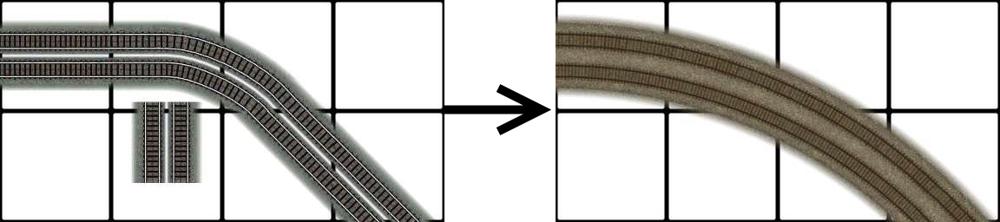
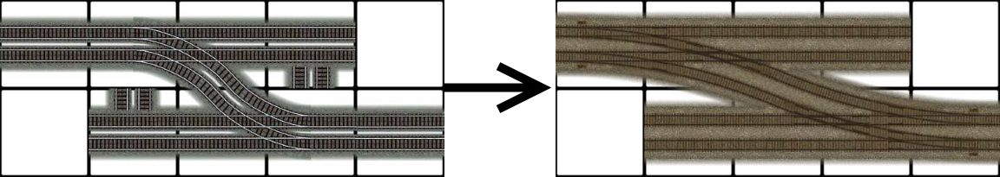
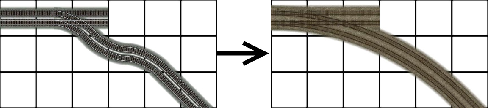
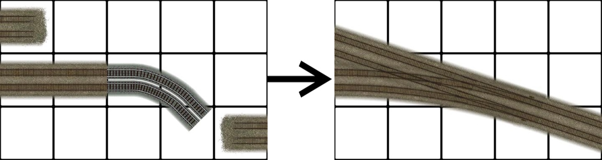
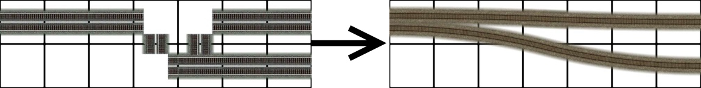
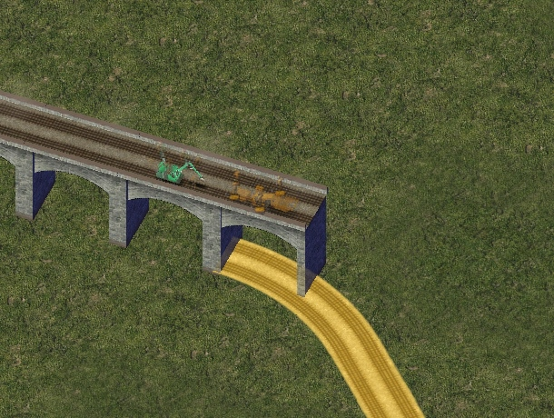
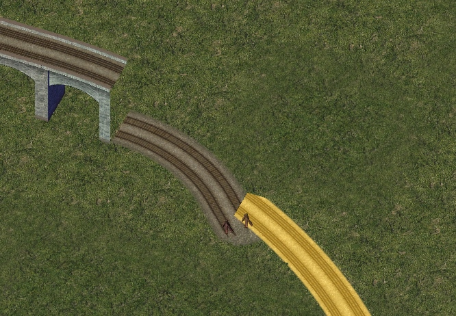
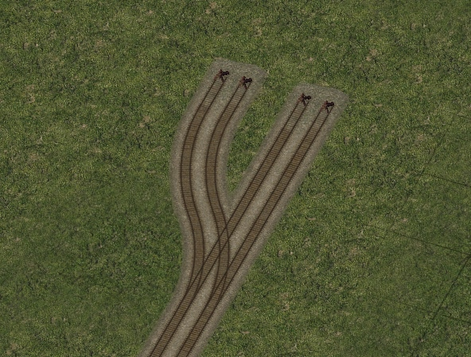
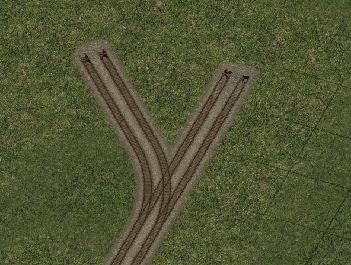
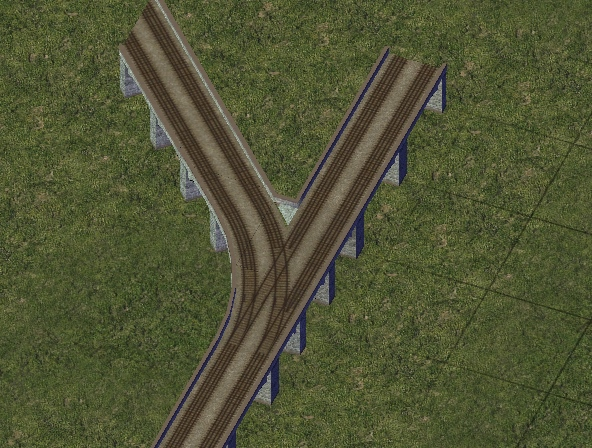

### RealRailway (RRW) Features

#### RealRailway (RRW)

The **RealRailway** or **(RRW)** is the new standard for rail transport in the NAM. The Real Railway surpasses the **Maxis Rail** and **Railway Addon Mod (RAM)** in favor of the Real Railway. The Real Railway is the only standard of rail that has continued work from the NAM Team since 2013 **(NAM 32)**. Many enhancements, such as FlexTrack, Fractional Angled Rails (FARR), and the draggable Elevated RealRailway (ERRW) are products exclusive to the Real Railway.

The RealRailway started with the "mini-curves", which were to replace the existing Maxis curves and turnouts with more realistic looking versions. The gauge was also changed to represent standard gauge (1435 mm), which approximates to 12 pixels in absolute terms. The track spacing was also changed from 4 meters to 4.5 meters. The founder of the project, **Swordmaster**, determined the best way to make realistic railways by spacing out the tracks with the new gauge which makes the outer rails run flush with the Maxis rails but not with the inner rails. Such differences can be noticed by running the RRW base through an unconverted Transport Enabled lot or other unsupported tracks. The RealRailway was at first basic in appearance and functionality. Further enhancements have made the RealRailway surpass the functionality of Maxis Rail.

Below is a snapshot from the initial 2013 RealRailway documentation and its reasoning behind the shift to the RealRailway...
 
<small>image taken from the RealRailway 2013 documentation.</small> 
 
<small>Notice how the road pieces line up with the real life road networks but the _Maxis_ Rail does not!</small> 
 
 
<small>image taken from the RealRailway 2013 documentation. 
 
</small><small>Extended</small><small>Radii from in the default curve for the RealRailway (308.48 px)compared to the maxis rail (172.8 px). 
</small> 

#### Basic Usage

The RealRailway has the same characteristics as the Maxis Rail, as well as covering the Puzzle Piece (PPs), wide radius curves (WRCs), Single Track Rail (STR), and large turnouts. **Swordmaster** made this available for easing the adoption of the Real Railway. Some draggable functionality has been changed to reflect the use of the mini-curves and their functionality.  

##### FlexTrack

</small><small>NAM 33 full release arrived with the next installment of the next
phase of the Real Railway known as FlexTrack. This continuation allowed
for midrange to large Wide Radius Curves under the nomenclature of  MRC's with Minicurves being the smallest at R1 to Large sweeping curves at R5. Patterns where derived to allow the curves to drawn
out with the rail tool without having to go into the puzzle piece tab
loop. R1, R2 and R3 can also be made into turnouts by drawing
orthogonally from the orthogonal end while there is support for
diagonal turnouts with R1 and R3. R4 and R5 do not support any turnouts
with there sole function to be curves! Also a range of new turnout
options were introduced with the RealRailway FlexTrack component. This
allowed for new turnouts in tight situations where the former parts
where not applicable or accessible. These improvements were spearheaded by eggman121 who developed the  new components. The base provided by Swordmaster allowed for these integrations.</small> 
 
FlexTrack Patterns 

<small>The FlexTrack currently relies on patterns to make the desired curves or turnouts/ switches. While there is the advantage of not having to go into the menu to find the pieces they can be hard to find the right patterns with conflicts if the pieces are too close to each other. Testing the capabilities in a blank region is always helpful to get the right patterns for the FlexTrack component. 
 
The patterns and resultants are shown below....</small>  
 

Curves. 
 
 
 
 
 
 
 
 
 
 
 
 

Turnouts 
<small> 
</small><small>The
turnouts and switches come in all sorts of forms and there are a range
of turnouts to use. They range from A1 Turnouts to large B2 extended
turnouts as well. The set classes are shown in the table below.Not all the turnouts have been made. Some of the possibilities will need flex implementation to be realised.The table shown is just an example of the proposed turnouts.Additional turnouts have been made possible however for the Real Railway. 
 
</small><small>(Table of proposed turnouts for the RealRailway)</small> 
 
A Class Turnouts 
 
 
 
 
 
 
 
 
 
 
 
 
 
 
 
 
 
 
 
B Class Turnouts 
 
 
 
 
 
 
 
 
 
 
 
C Class Turnouts 
 
 
 
 
 
 
 
D Class Turnouts 
 
 
 
 
 
E Class Turnouts 
 
 
 
 
 
 
 
 
 
 
 
 
 
 
 
<small>The
FARR-2 Alt has the same angle as the normal FARR-2 but has a different
base and pattern. Also the geometry is slightly different and can make
complex turnouts as shown further in the document. The FARR-2
Alternative implementation is considered a FlexTrack item.</small><small>Below are the various setups</small>.<small>The base for the FARR-2 Alt is the zig zag base and is designed for
flat surfaces only. This section of track has no tolerance for slopes!</small><small> 
</small> 
 
 
 
 
 
 
 
 
 
 
<small>The
small complex turnouts compliments the FARR-2 Alt with turnout setups
that cross double track rail DTR with both single track rail STR and
DTR variants. Upgrading to DTR involves drawing through the middle
pointsas shown by the red arrow. </small> 
 
 
 
 
 
 
 
 
 
 
 
<small>The
Fractional angled Rail Road (FARR) as it will be referenced from now is
the angled sections of track that conform to three angles to compiment
the orthogonal (0 degrees) and diagional (45 degrees). They are FARR-3
(18.43 degrees), FARR-2 (26.56 degrees) and FARR-1.5/1.33 (33.69
degrees). At the time of writing this document the FARR is only able to
be drawn
out using the rail tool. Flex pieces for these sections of track are
anticipated but will arrive in a future edition of the NAM. 
 
Patterns are shown below...</small> 
 
FARR-3 
 
FARR-3 Stright 
 
 
 

FARR-3 to Orthogonal 
 
 
 
FARR-3 to Diagonal 

 

 
 
FARR-3 to FARR-2 
 
 
 
FARR-2 

 

FARR-2 Stright 
 
 
FARR-2 to Orthogonal 

 

 
 
FARR-2 to Diagonal 
 
 
 
FARR-2 to FARR-1.5/1.33 

 

 
FARR-2 G2 Tunout 
 
 
 
FARR-1.5/1.33 

FARR-1.5/1.33 Stright 

 

 
FARR-1.5/1.33 to Orthogonal 

 

 
FARR-1.5/1.33 to Diagonal 

 

 
 
FARR-1.5/1.33 J2 Tunout 
 
 
 
 
 
<small>The
next installment of the Real Railway (RRW) implementation is the
elevated real railway (ERRW). As oppose to using puzzle pieces the ERRW
is the draggable format of the heavy rail
viaducts. Use is slightly different in that the ERRW uses overrides to
work using the DTR as the Base. There are two levels for the ERRW
including the 15.5 meter height and the new 7.5 m height. At the moment
the two levels are independent and therefore cannot be joined together
from an elevated height.  
 
Both variants include support for some minicurves and multi radius curves. The MRC's supported are Radius (1, 2 and 3). 
 
The ERRW pieces can be found in this menu near the top of the Rail menu in the picture shown below... 
 
</small><small> 
 
There are 4 main elevated transitions conforming to the on slope standard 
 
Orthogonal Transitions 
 
 
 
Diagonal Transitions 
 
</small> 
 
 
 
<small>The rail is not to be drawn through the transition but to the stub at each end shown in the pictures below... 
 
</small><small> 
 
</small><small>White represents the adjoining stub connections while Black represents the network you want to cross. 
 
The same principle is used for the Diagonal on slope transitions. 
</small><small> 
</small> 
 
<small>Upon a successful draw you should see something like this... 
</small><small> 
 
 
</small><small>This is the preview of the ERRW before placing it. Previews are used for the majority of the ERRW and work in most instances. 
</small> 
 
<small>As mentioned above the R1, R2 and R3 curves can have overrides at each level for making elevated smooth curves</small>. <small>They use the flextrack base to work so they only work with the RRW flextrack curves</small>. 
 
R1 Curve 
 
 
 
 
R2 Curve 
 
 
 
 
R3 Curve 
 
 
 
 
 
MiniCurves 
 
<small>Some Minicurves and Mini Turnouts can be override to have elevated turnouts. Only some are shown below...</small> 
 
A2 Turnout 
 
 
 
B2 Turnout 
 
 
 
 
A2 Wye Turnout 
 
 
 
 
 

 

<small>When crossing other networks a rail piece MUST!
be placed on the concerning tile if you are crossing a non rail network.
This is due to the fact that rail code must be present in the network.
Level crossings (LX) overridden by the ERRW are exempt however. A
picture of what you should do is shown below...</small> 
 
 
<small> 
Of course this action is not needed if the network being crossed is the Rail network itself</small>. 
 
 
 
Credits  
 
The following members have had an impact on the development of the RealRailway Mod and are listed below. 

- Swordmaster
- eggman121
- mgb204/rsc204
- woodb3kmaster
- Tarkus
- memo
- Shadow Assassin
- rivit
- Simmer2

Without their help, directly or indirectly, these projects for the Real Railway would not have taken off.