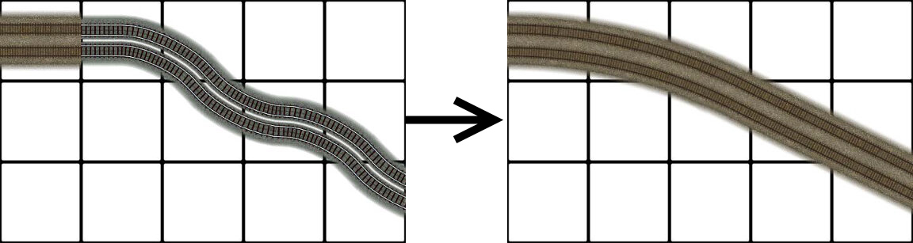
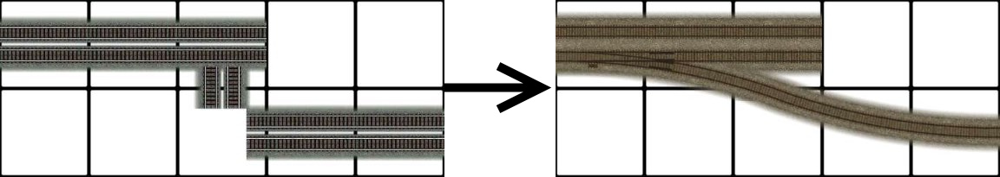
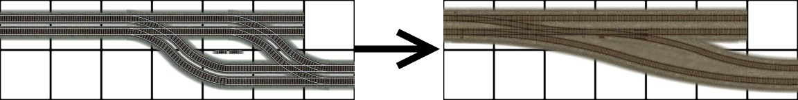
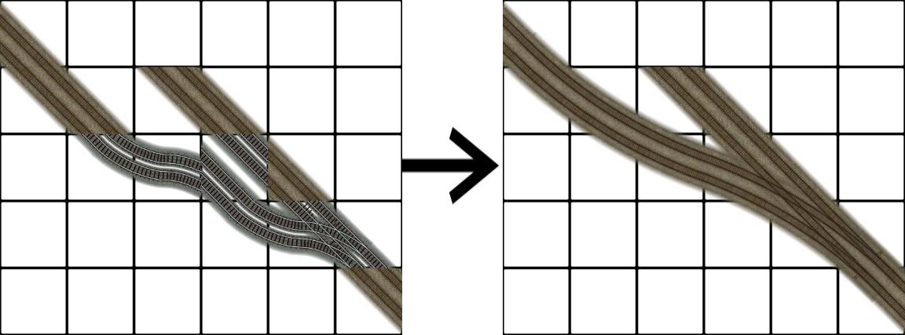
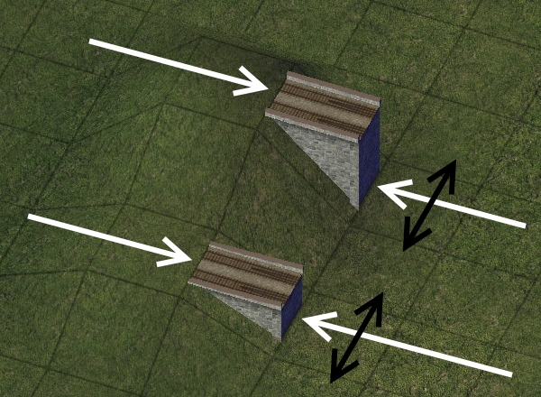
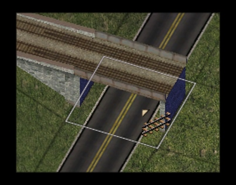



## Development History  

The **RealRailway** or **(RRW)** is the new standard for rail transport in the NAM. RealRailway supersedes **Maxis Rail** and **Railway Addon Mod (RAM)**. RRW is the only standard of rail receiving continual updates by the NAM Team since 2013 **(NAM 32)**. Many enhancements, such as FlexTrack, Fractional Angled Rails (FARR), and the draggable Elevated RealRailway (ERRW) are products exclusive to the RealRailway.

The RealRailway began with "mini-curves", which were to replace the existing Maxis curves and turnouts with a more realistic minimum curve radius:

  

Numerous other improvements followed including:

- Changing the gauge to represent standard gauge (1435 mm), which approximates to 12 pixels in absolute terms.
- Changing the track spacing from 4 meters to 4.5 meters.

The founder of the project, **Swordmaster**, determined the best way to make realistic railways by spacing out the tracks with the new gauge which makes the outer rails run flush with the Maxis rails but not with the inner rails.

The following is a snapshot from the initial 2013 RealRailway documentation which demonstrates the rationale for the shift to the RRW standard:  

  

Notice how the road pieces line up with the real life road networks but the _Maxis_ Rail does not!  

At first, RealRailway was basic in appearance and functionality.  However, further enhancements have led to RRW surpassing the functionality of Maxis rail in the NAM.

---

## Basic Usage  

RealRailway is a complete replacement of the rail network.  Basic double-track rail (**DTR**) is drawn using the rail tool and advanced functionality is achieved with draggable patterns or ploppable FLEX pieces.  Single-track rail (**STR**) is provided as an override network and can initiated by a dedicated starter or by certain FLEX turnouts.  RRW also covers legacy DTR puzzle pieces and wide radius curves.

An explanation of the RRW menu icons is given below.

## FlexTrack

NAM 33 delivered a suite of new functionality to the RealRailway known as FlexTrack. This advancement allowed for medium to large wide radius curves rechristened as _multi-radius curves_ (**MRC**).  Under the MRC nomenclature, sizes range from the smallest existing minicurves at **R1** to large, sweeping curves  at **R5**. Patterns were devised to allow the curves to drawn out with the rail tool without having to go into the puzzle piece tab loop. R1, R2 and R3 can also be made into turnouts by drawing orthogonally from the orthogonal end while there is support for diagonal turnouts with R1 and R3. R4 and R5 do not support any turnouts with there sole function to be curves! Also a range of new turnout options were introduced with the RealRailway FlexTrack component. This allowed for new turnouts in tight situations where the former parts where not applicable or accessible. FlexTrack improvements were spearheaded by **eggman121** who developed the new components building on the base provided by **Swordmaster**.

The FlexTrack currently relies on patterns to make the desired curves or turnouts/ switches. While there is the advantage of not having to go into the menu to find the pieces they can be hard to find the right patterns with conflicts if the pieces are too close to each other. Testing the capabilities in a blank region is always helpful to get the right patterns for the FlexTrack component.

The patterns and resultants are shown below.

### Curves













### Macro Curves

At the start of the TAB loop for FLEX-Pieces there are a number of Pieces called _macro_-curves and switches. These are switches with wider geometry than previously-developed _mini_-curves which occupy a similar footprint. The curves and switches are offered as FLEX only due to the drag patterns arlready being used for the mini-curves. Macro-curves and switches are quite flexible in that drawing the rail tool through the piece placed down can make an array of different switches as shown in the table below.

### Fractional Angle Railroad (FARR)

Fractional Angle Rail Road (**FARR**) is the angled sections of track that conform to three angles which compiment the orthogonal (0 degrees) and diagional (45 degrees). They are FARR-3 (18.43 degrees), FARR-2 (26.56 degrees) and FARR-1.5 (33.69 degrees). FARR was originally developed to use drag patterns as the means of creation, however, the majority these patterns were replaced by FLEX piece implementation with NAM 37.  FARR Flex piece usage and remaining drag patterns are documented in this section.

#### FARR Flex Piece Usage

#### FARR-2 Drag Patterns

FARR-2 G2 Turnout

#### FARR-1.5 Drag Patterns

FARR-1.5 to Diagonal

FARR-1.5 J2 Turnout

#### FARR-2 Alt

The FARR-2 Alt has the same angle as the normal FARR-2 but has a different base and pattern. Also the geometry is slightly different and can make complex turnouts as shown further in the document. The FARR-2 Alternative implementation is considered a FlexTrack item.  Below are the various setups.  The base for the FARR-2 Alt is the zig zag base and is designed for _flat surfaces only_. This section of track has **no slope tolerance**.

FARR-2 Alt Straight

FARR-2 Alt to Orthogonal

FARR-2 Alt to Diagonal

FARR-2 Alt G2 Turnout

### Turnouts

The turnouts and switches come in all sorts of forms and there are a range of turnouts to use. They range from A1 Turnouts to large B2 extended turnouts as well. The set classes are shown in the table below. Not all the turnouts have been made. Some of the possibilities will need flex implementation to be realised. The table shown is just an example of the proposed turnouts. Additional turnouts have been made possible however for the Real Railway.



#### A Class Turnouts

#### B Class Turnouts

#### C Class Turnouts

#### D Class Turnouts

#### E Class Turnouts

#### FARR-2 Alt Turnouts

The small complex turnouts compliments the FARR-2 Alt with turnout setups that cross DTR with both STR and DTR variants. Upgrading to DTR involves drawing through the middle points as shown by the red arrow.  

  

---  

## Elevated RealRailway (ERRW)  

Elevated RealRailway (**ERRW**) is the draggable implementation of heavy rail viaducts. ERRW is implemented at both L1 (7.5m) and L2 (15.5m). Both variants include support for some minicurves and multi radius curves. The MRCs supported are Radius (1, 2 and 3). 

### Height Transitions

Switching between ground level (L0) RRW and ERRW is accomplished using FLEX transition pieces found in the *Draggable Elevated Railways (ERRW)* menu.  

#### Usage Notes  

The rail is not to be drawn through the transition but to the stub at each end shown in the pictures below...

  

White represents the adjoining stub connections while Black represents the network you want to cross.  

Upon a successful draw you should see something like this...

This is the preview of the ERRW before placing it. Previews are in-place for the majority of the ERRW.

#### On-Slope Transitions  

Orthogonal on-slope transitions support the following configurations:

- L0 to L2  (_15.5m embankment_)
- L1 to L2  (_8m embankment_)
- L0 to L1  (_7.5m embankment_)

Diagonal on-slope transitions support the following configurations:

- L0 to L2 (_15.5m embankment_)
- L0 to L1 (_7.5m embankment_)

#### Ramp-style Transitions  

It is also possible to transition from RRW to ERRW using ramp-style transitions.

  

### Curves and Turnouts

As mentioned above the R1, R2 and R3 curves can have overrides at each level for making elevated smooth curves. They use the flextrack base to work so they only work with the RRW flextrack curves.

R1 Curve  

R2 Curve  

R3 Curve  

MiniCurves

Some Minicurves and Mini Turnouts can be override to have elevated turnouts. Only some are shown below...

A2 Turnout  

B2 Turnout

A2 Wye Turnout  

  

### Crossings

When crossing other networks a rail piece MUST! be placed on the concerning tile if you are crossing a non-rail network. This is due to the fact that rail code must be present in the network. Level crossing (LX) overridden by the ERRW are exempt however. A picture of what you should do is shown below...

Of course this action is not needed if the network being crossed is the Rail network itself.

#### Crossing Support

##### L1

|      Network     |   OxO   | OxD | DxO | DxD |
|:----------------:|:-------:|:---:|:---:|:---:|
|      Street      |   Yes   |  No |  No |  No |
|       Road       |   Yes   |  No |  No |  No |
|   One Way Road   |   Yes   |  No |  No |  No |
|      Avenue      |   Yes   |  No |  No |  No |
|   Maxis Highway  |   Yes   |  No |  No |  No |
| Real Railway DTR |   Yes   |  No |  No | Yes |
| Real Railway STR |   Yes   |  No |  No | Yes |
|        MIS       |   Yes   |  No |  No |  No |
|       RHW-2      |   Yes   |  No |  No |  No |
|       RHW-3      | Partial |  No |  No |  No |
|      RHW-4S      |   Yes   |  No |  No |  No |
|      RHW-6S      |   Yes   |  No |  No |  No |
|      RHW-6C      |   Yes   |  No |  No |  No |
|      RHW-8S      |   Yes   |  No |  No |  No |
|      RHW-8C      |   Yes   |  No |  No |  No |
|      RHW-10S     |   Yes   |  No |  No |  No |
|       TLA3       |   Yes   |  No |  No |  No |
|       AVE2       |   Yes   |  No |  No |  No |
|       OWR-1      |   Yes   |  No |  No |  No |
|       OWR-3      |   Yes   |  No |  No |  No |
|       NRD-4      |   Yes   |  No |  No |  No |
|       TLA-5      |   Yes   |  No |  No |  No |
|       OWR-4      |   Yes   |  No |  No |  No |
|       OWR-5      |   Yes   |  No |  No |  No |
|       RD-4       |   Yes   |  No |  No |  No |
|       RD-6       |   Yes   |  No |  No |  No |
|       TLA-7      |   Yes   |  No |  No |  No |
|       AVE-6      |   Yes   |  No |  No |  No |
|     GLR Sets     |   Yes   |  No |  No |  No |
|        TOS       | Partial |  No |  No |  No |
|        TOR       | Partial |  No |  No |  No |
|        TIA       | Partial |  No |  No |  No |
|     SAM Sets     |   Yes   |  No |  No |  No |
|       GHSR       |   Yes   |  No |  No |  No |


##### L2


|      Network     |   OxO   | OxD | DxO | DxD |
|:----------------:|:-------:|:---:|:---:|:---:|
|      Street      |   Yes   |  No |  No |  No |
|       Road       |   Yes   |  No |  No |  No |
|   One Way Road   |   Yes   |  No |  No |  No |
|      Avenue      |   Yes   |  No |  No |  No |
|   Maxis Highway  |   Yes   |  No |  No |  No |
| Real Railway DTR |   Yes   |  No |  No | Yes |
| Real Railway STR |   Yes   |  No |  No | Yes |
|        MIS       |   Yes   |  No |  No |  No |
|       RHW-2      |   Yes   |  No |  No |  No |
|       RHW-3      | Partial |  No |  No |  No |
|      RHW-4S      |   Yes   |  No |  No |  No |
|      RHW-6S      |   Yes   |  No |  No |  No |
|      RHW-6C      |   Yes   |  No |  No |  No |
|      RHW-8S      |   Yes   |  No |  No |  No |
|      RHW-8C      |   Yes   |  No |  No |  No |
|      RHW-10S     |   Yes   |  No |  No |  No |
|       TLA3       |   Yes   |  No |  No |  No |
|       AVE2       |   Yes   |  No |  No |  No |
|       OWR-1      |   Yes   |  No |  No |  No |
|       OWR-3      |   Yes   |  No |  No |  No |
|       NRD-4      |   Yes   |  No |  No |  No |
|       TLA-5      |   Yes   |  No |  No |  No |
|       OWR-4      |   Yes   |  No |  No |  No |
|       OWR-5      |   Yes   |  No |  No |  No |
|       RD-4       |   Yes   |  No |  No |  No |
|       RD-6       |   Yes   |  No |  No |  No |
|       TLA-7      |   Yes   |  No |  No |  No |
|       AVE-6      |   Yes   |  No |  No |  No |
|     GLR Sets     |   Yes   |  No |  No |  No |
|        TOS       | Partial |  No |  No |  No |
|        TOR       | Partial |  No |  No |  No |
|        TIA       | Partial |  No |  No |  No |
|     SAM Sets     |   Yes   |  No |  No |  No |
|       GHSR       |   Yes   |  No |  No |  No |


## Credits

The following members contributed to the development of the RealRailway:

- Swordmaster
- eggman121
- mgb204/rsc204
- woodb3kmaster
- Tarkus
- memo
- Shadow Assassin
- rivit
- Simmer2
- flann
